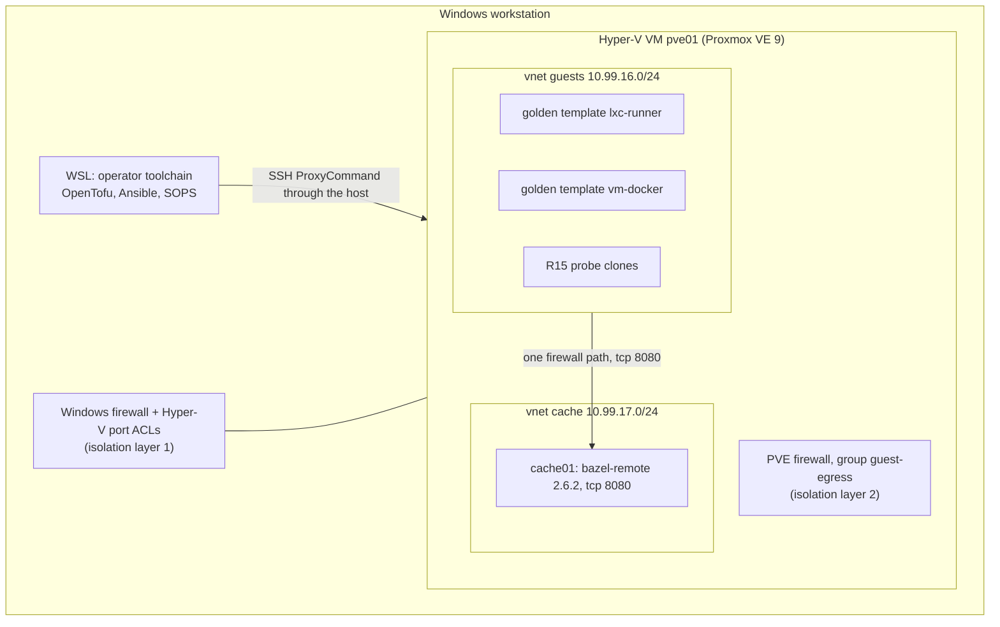

# Homelab CI platform on Proxmox VE 9

A neutral homelab baseline: Proxmox VE 9 runs as a Hyper-V VM on a Windows workstation, is rebuilt entirely from code, and is meant to host single-use CI runners. This repository holds the code, the measured evidence and the knowledge gathered while building it, so it can be reviewed, forked and developed further.

## Status

| Phase | Scope | State |
|---|---|---|
| 0 | Requirements and decisions | Done (`docs/platform/requirements.md`) |
| 1 | Windows host, Hyper-V VM `pve01`, unattended PVE 9 install, two-layer isolation | Done, measured (rows 35 to 42) |
| 2 | IaC foundation: OpenTofu + Ansible, SOPS + age, firewall, API identity, guest network | Done, measured (rows 43 to 54) |
| 3 | Golden templates `lxc-runner` and `vm-docker`, versioning, rollback, weekly rebuild | Done, measured (rows 55 to 60) |
| 4 | Build cache service `bazel-remote` and its client | Done, measured (rows 61 to 70) |
| 5 | Runner pool controller | **Not built**, handed off |
| 6 | Reusable workflows and cutover to the new runners | **Not built**, handed off |
| 7 | Observability, alerts, backups | **Not built**, handed off |
| 8 | Rebuild-from-zero proof and portability proof | **Not built**, handed off |

Phases 5 to 8 are described, with their entry gates, in [`docs/handoff/`](docs/handoff/README.md). CI runs on GitHub-hosted runners today ([ADR 0054](docs/adr/0054-run-ci-on-hosted-runners-until-the-runner-pool-exists.md)): `sdet-ci.yml` forces `force_ubuntu_runner` on push and pull request. The self-hosted path (golden templates and the build cache) is wired and proven on the host, but no self-hosted runner is online until Phase 5: the retired host's runners are offline and stay registered until Phase 6 deregisters them. Hosted jobs run with the cache disabled (row 68).

## Architecture



| Part | What it is | Decision |
|---|---|---|
| Host VM | Gen2 Hyper-V VM, 12 vCPU, 20 GiB static RAM, 128 GiB dynamic VHDX, internal switch plus WinNAT | ADR 0003, 0006 |
| Isolation (R15) | Two layers: Hyper-V extended port ACLs with a Windows Firewall rule, and the classic PVE firewall with a `guest-egress` security group. Runner guests reach the internet and the cache path only | ADR 0007, 0027, 0028 |
| IaC | OpenTofu (`bpg/proxmox`) for SDN, guests and template downloads; Ansible for OS, firewall files, the API identity and the template framework; state local and encrypted | ADR 0012, 0013, 0025 |
| Secrets | SOPS + age, one file per consumer and host, one writer each | ADR 0009, 0033 |
| Guest network | SDN zone `hlab` with vnets `guests` and `cache`, source-NATed, static addresses, port isolation on `guests` | ADR 0030, 0045 |
| Golden templates | `lxc-runner` and `vm-docker`, built on the host by a root orchestrator, two versions kept, one-command rollback, weekly rebuild | ADR 0038 to 0044 |
| Build cache | `bazel-remote` in container `cache01` on the `cache` vnet; anonymous reads, one writer credential, content-addressed keys, outputs restored only on an exact match | ADR 0048 to 0050 |
| Evidence and knowledge | Sanitized transcripts per phase and a defect and test catalogue, published from the operator's machine | ADR 0052 |

## Measured results

Every number cites a row of [`docs/platform/requirements.md`](docs/platform/requirements.md) (section 3) or a run.

| Result | Value | Source |
|---|---|---|
| Hosted baseline, full suite, cold cache | 71 s | row 15, run 37355482969 |
| Cache hit ratio, unchanged lockfile, 20 fresh-workspace runs | dependencies 38/38, outputs 19/19 on runs 2 to 20 | row 63 |
| R15 negatives blocked, runner clones, with the cache path | 19/19 negatives, 2/2 positives; unchanged after a `pve01` reboot | row 66 |
| R15 negatives blocked, cache container | 12/12 negatives, 1/1 positive | row 66 |
| Golden template build | about 2 min 15 s (`lxc-runner`), about 3 min 5 s (`vm-docker`) | row 55 |
| `pve01` reboot to cache service ready | SSH at 43 s, container at 45 s, service at 49 s | row 67 |
| Stale-binary test (red first) | stale variant detected, new design fresh | row 64, cache CI run 37592628530 |

The performance targets of the platform (full suite 60 s or less with warm caches, queue-to-start p95 10 s or less, scale-from-zero 30 s or less) need the runner pool and are not measured yet.

## Repository layout

| Path | Purpose |
|---|---|
| [`iac/`](iac/README.md) | Inventory, Ansible, OpenTofu, secrets, runner-class policy |
| [`scripts/hyperv/`](scripts/hyperv/README.md) | Windows side: create and operate the `pve01` VM, isolation layer 1 |
| `scripts/iac/` | Wrappers: `ansible.sh`, `tofu.sh`, `render-ssh-config.sh`, `cache-writer-secret.sh` |
| `scripts/bootstrap/` | `operator-toolchain.sh`: pinned, hash-verified tools for WSL |
| `scripts/ci/build_cache/` | Build-cache client (domain, application, adapters) |
| `scripts/evidence/` | `publish.py`: sanitized evidence publisher and checker |
| `scripts/apps/` | Affected-test selector for the .NET sample solution |
| `tests/` | Isolation and template tests (`tests/isolation/`), cache client tests (`tests/cache/`), evidence tests, selector harness |
| `apps/` | Sample workloads that the CI runs (see [`apps/README.md`](apps/README.md)) |
| `.github/workflows/` | CI: IaC gate, cache client, evidence gate, secret scan, SDET pipeline |
| `docs/adr/` | Architecture decision records, 0001 to 0053 |
| `docs/platform/requirements.md` | Requirements, measured constraints, decision log |
| `docs/evidence/` | Sanitized run transcripts per phase, each with an `INDEX.md` |
| `docs/knowledge/` | Defects only the real host exposed, and the test catalogue |
| `docs/handoff/` | What is not built and how to continue |
| `wiki/` | Pages mirrored to the GitHub wiki |

## Get started

Operator toolchain, in WSL Debian, as root:

```sh
bash scripts/bootstrap/operator-toolchain.sh
```

Create the VM, from an elevated Windows prompt: [`scripts/hyperv/README.md`](scripts/hyperv/README.md). Then configure and provision from WSL:

```sh
bash scripts/iac/ansible.sh bootstrap.yml -e ansible_user=root
bash scripts/iac/ansible.sh site.yml
bash scripts/iac/tofu.sh proxmox-host pve01 init-passphrase
bash scripts/iac/tofu.sh proxmox-host pve01 init
bash scripts/iac/tofu.sh proxmox-host pve01 apply
```

Templates, the R15 probe and the cache follow [`RUNBOOK.md`](RUNBOOK.md). A reader who was not part of this work should start with `docs/handoff/README.md`.

## Tests

Without a host (the same checks CI runs):

```sh
for t in tests/isolation/test-*.sh; do bash "$t"; done
python3 -m unittest discover -s tests/cache -p 'test_*.py'
python3 -m unittest discover -s tests/evidence -v
tofu -chdir=iac/tofu/stacks/<stack> test
```

[`docs/knowledge/test-catalogue.md`](docs/knowledge/test-catalogue.md) lists every test with what it proves, its command and its CI job. A claim that only the real host can prove is marked there and backed by `docs/evidence/`.

## Project rules

Contribution and agent rules are in [`AGENTS.md`](AGENTS.md). In short: neutral, English-only artifacts (ADR 0002), one decision per ADR, no secrets on a command line, and every measured claim linked to a raw log or a run.
