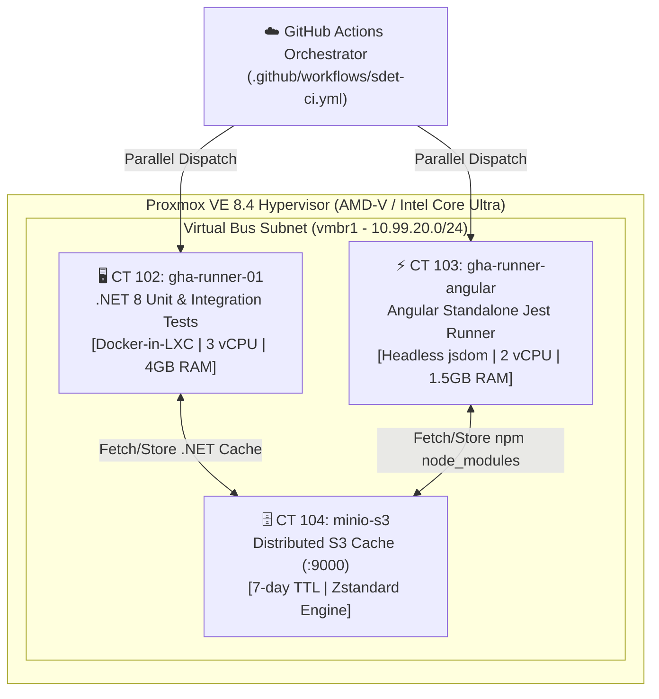

# 🚀 Booth Homelab: SDET & IaC Testing Rig

[](https://github.com/ugritchaichana/booth-homelab/releases)
[](https://github.com/ugritchaichana/booth-homelab/actions/workflows/sdet-ci.yml)
[](https://github.com/ugritchaichana/booth-homelab/actions/workflows/wiki-sync.yml)
[](https://www.proxmox.com/)
[](https://tailscale.com/)
[](https://min.io/)
[](https://dotnet.microsoft.com/) [target framework](https://github.com/ugritchaichana/booth-homelab/blob/179f82606f06823ebb04773777d3d1fd8c2728ae/apps/backend/src/Core.Domain/Core.Domain.csproj#L4)
[](https://angular.dev/)

## 📖 About The Project

**Booth Homelab** is a Continuous Testing Rig engineered to run continuous integration, parallel test suites, and infrastructure-as-code automation locally without cloud bill inflation or network bottlenecks.

- **Dual-Runner Testing Fleet:** Dedicated Proxmox VE LXC containers (provisioned privileged: [`provision-runner.py#L151`](https://github.com/ugritchaichana/booth-homelab/blob/179f82606f06823ebb04773777d3d1fd8c2728ae/scripts/proxmox/provision-runner.py#L151), [`provision-angular-runner.py#L186`](https://github.com/ugritchaichana/booth-homelab/blob/179f82606f06823ebb04773777d3d1fd8c2728ae/scripts/proxmox/provision-angular-runner.py#L186); moving to unprivileged CTs is open) running isolated .NET 8 (`pve-runner-01`) and Angular Jest (`pve-runner-angular`) test environments.
- **Virtual Bus Cache:** MinIO S3 remote cache across an internal Linux bridge (`vmbr1`). A cache restore downloaded 27.89 MiB at 824.29 MiB/s in [run 37235401356](https://github.com/ugritchaichana/booth-homelab/actions/runs/37235401356/job/111533373752).
- **Transitive Dependency Graph Testing:** AST-based code-change traversal that builds and tests only affected modules.
- **AI-Ready:** Documented with human-facing guides ([README.md](README.md), [RUNBOOK.md](RUNBOOK.md)) and machine-readable operational truth ([AI_CONTEXT.md](AI_CONTEXT.md)) for agent-assisted development.

---

## 🏛️ System Architecture & Topology

The homelab leverages a Linux Container (LXC) architecture on Proxmox VE (runner CTs are provisioned privileged, see above; the OpenTofu module targets unprivileged: [`main.tf#L10`](https://github.com/ugritchaichana/booth-homelab/blob/179f82606f06823ebb04773777d3d1fd8c2728ae/iac/tofu/modules/lxc_runner/main.tf#L10)) connected via an isolated internal bridge (`vmbr1`) operating as the virtual bus between the runners and the cache.



---

## ⚡ Key Architectural Highlights

### 1. Parallel Dual-Runner Testing Rig
- **.NET 8 Runner (`pve-runner-01` / CT 102):**
  - Dedicated Debian 12 LXC configured with `nesting=1` and `keyctl=1` for Docker-in-LXC.
  - Executes C# unit tests and integration tests (`OrderProcessingIntegrationTests.cs`) deterministically using `/p:Deterministic=true`.
  - Integrates an AST Transitive Dependency Graph analyzer to execute only affected test suites based on `git diff`.
- **Angular Jest Runner (`pve-runner-angular` / CT 103):**
  - Dedicated Debian 12 LXC. The repo provisions Node.js 22 ([`main.yml#L8`](https://github.com/ugritchaichana/booth-homelab/blob/179f82606f06823ebb04773777d3d1fd8c2728ae/iac/ansible/roles/runner_angular/tasks/main.yml#L8), `setup_22.x`); the live CT 103 still reports major 20 until it is re-provisioned ([run 37347994171](https://github.com/ugritchaichana/booth-homelab/actions/runs/37347994171/job/111891371382) prints the `node20` cache-key prefix).
  - Pure headless testing using `jest-preset-angular` and `jsdom` (no Chromium or GUI browser overhead).
  - Executes 4 spec suites (29 test cases) across components and services; Jest reported `Time: 5.775 s` in [run 37347994171](https://github.com/ugritchaichana/booth-homelab/actions/runs/37347994171/job/111891371382).

### 2. Virtual Bus Remote Cache (MinIO S3 + Zstandard)
- Dependencies and compilation artifacts are compressed with Zstandard (`zstd -T0`) and stored on **CT 104 MinIO S3** over `10.99.20.20:9000`.
- **Warm Restores:** On a cache hit, `node_modules` (27.89 MiB) is downloaded from MinIO with a logged duration of `00m00s` in [run 37235401356](https://github.com/ugritchaichana/booth-homelab/actions/runs/37235401356/job/111533373752).
- **Fewer External Dependencies:** A cache-hit restore reads from CT 104 instead of the public npm/NuGet registries.

### 3. Network Isolation, Firewall & Host Protection
- **Layer 2 Bridge Port Isolation & Netfilter:**
  - Bridge port isolation (`isolated on`) prevents East-West frame switching between test runners (`CT 102` and `CT 103`).
  - Kernel netfilter (`HOMELAB-FORWARD`) strictly blocks East-West runner traffic, rejects runner access to the MinIO web console (`:9001`), and permits runner access only to the MinIO S3 API (`:9000`).
  - Host ingress firewall (`HOMELAB-INPUT`) drops runner traffic destined for the host management plane (`:22` SSH and `:8006` Proxmox API).
  - Outbound egress is strictly scoped via `ipset` to authorized package/API registries (`api.github.com`, `registry.npmjs.org`, `api.nuget.org`, Debian mirrors) with default-deny dropping all unauthorized high ports and external IPs.
- **Least-Privilege IAM & Integrity Verification (Cache Poisoning Prevention):**
  - Runners hold only a bucket-scoped reader alias (user from `SDET_PR_READER_USER`); the writer account (`SDET_CI_WRITER_USER`) credential reaches only the master cache-save job through the `cache-writer` GitHub Environment secrets, as an alias that lives for that job only.
  - Enforced only once `configure_iam_cache_accounts.py` is re-run with rotated passwords and the `cache-writer` Environment is restricted to `master`; until then the previous credentials remain live.
  - S3 archives enforce SHA256 integrity digest verification before decompression into the workspace with path traversal rejection.
- **Zero Public WAN Exposure:**
  - Hypervisor management and containers reside behind Tailscale WireGuard Mesh with Subnet Routing (`10.99.10.0/24`, `10.99.20.0/24`).

### 4. Credential Hardening & Standards

> [!IMPORTANT]
> **Credential Security Advisory:**  
> All administrative and API credentials must be injected via environment variables (`PVE_PASS`, `PVE_TOKEN_SECRET`, `MINIO_ROOT_USER`, `MINIO_ROOT_PASSWORD`) and encrypted secret stores. Plaintext credentials must never be committed to source control.

#### Production Password Standards (NIST SP 800-63B / CIS Benchmark)
When deploying beyond an isolated development sandbox, generate passwords and secrets compliant with the following standards:
- **Length:** Minimum **16 to 24+ characters** for root/administrative accounts; minimum **32+ characters** for CI/CD API tokens and service keys.
- **Character Composition:** Must contain a balanced mixture of four character classes:
  - Uppercase letters (`A-Z`)
  - Lowercase letters (`a-z`)
  - Decimal digits (`0-9`)
  - Special symbols (`!@#$%^&*()-_+=[{]}|:;,.<>?~`)
- **Entropy & Pattern Defense:** Zero dictionary words, no sequential strings (`123456`, `qwerty`), and no homelab, project, or personal identifiers (`booth`, `minio`, `proxmox`).
- **Role-Based Least Privilege:** Never reuse root administrative credentials (`minioadmin`) across pipeline jobs. Provision dedicated IAM Service Accounts with granular policies (e.g., Read-Only for PR builds, Write for master releases).

---

## 📊 Performance Benchmarks

Each value is printed by the linked job log (`[BENCHMARK]` and Jest lines); a figure without a link is not claimed.

| Pipeline Stage | Target Runner | First run (npm cache miss) | Second run (npm cache hit) |
| :--- | :--- | :--- | :--- |
| **.NET Build Time** | `pve-runner-01` (CT 102) | 4252 ms ([run 37233575350](https://github.com/ugritchaichana/booth-homelab/actions/runs/37233575350/job/111528207387)) | 4707 ms ([run 37235401356](https://github.com/ugritchaichana/booth-homelab/actions/runs/37235401356/job/111533415551)) |
| **.NET Affected Test Runner Time** | `pve-runner-01` (CT 102) | 13 ms ([run 37233575350](https://github.com/ugritchaichana/booth-homelab/actions/runs/37233575350/job/111528312574)) | 16 ms ([run 37235401356](https://github.com/ugritchaichana/booth-homelab/actions/runs/37235401356/job/111533483063)) |
| **Angular Jest Tests Completed in** | `pve-runner-angular` (CT 103) | 103003 ms, npm install ([run 37233575350](https://github.com/ugritchaichana/booth-homelab/actions/runs/37233575350/job/111528154780)) | 3856 ms ([run 37235401356](https://github.com/ugritchaichana/booth-homelab/actions/runs/37235401356/job/111533373752)) |

---

## 📁 Repository Directory Structure

```text
Booth-homelab/
├── .github/
│   ├── actions/                       # Composite actions
│   │   ├── minio-cache/               # MinIO S3 restore and save routines
│   │   ├── run-affected-tests/        # .NET transitive affected test runner
│   │   └── run-angular-jest/          # Angular Jest suite & cache integration
│   └── workflows/
│       ├── pr-labeler.yml             # Auto-labeler for area and application PRs
│       ├── pr-reviewer-guard.yml      # Strips unneeded Copilot reviewers from PRs
│       ├── reusable-sdet-pipeline.yml # Modular 6-stage parallel DAG pipeline
│       ├── sdet-ci.yml                # Top-level orchestrator calling reusable pipeline
│       └── wiki-sync.yml              # Autonomous wiki synchronization engine
│
├── apps/                              # Application Workloads & Test Suites
│   ├── backend/                       # .NET 8 Multi-Project Testing Solution
│   │   ├── SdetTestingRig.sln
│   │   ├── Directory.Build.props      # Enforces /p:Deterministic=true
│   │   ├── src/                       # Domain, Application, Billing.Api, Order.Api
│   │   └── tests/                     # Billing.Api.UnitTests, Order.Api.UnitTests, Order.Api.IntegrationTests
│   └── frontend/                      # Angular 18/19 Standalone Jest Rig
│       ├── package.json               # Dependencies & Jest configuration
│       ├── jest.config.js             # Headless jsdom preset configuration
│       └── src/app/                   # Billing & Order components and spec tests
│
├── iac/                               # Infrastructure as Code
│   ├── tofu/                          # OpenTofu Provisioning (bpg/proxmox)
│   │   ├── flavors.json               # Multi-Cloud Instance Catalog (AWS, GCP, Azure, Hetzner, DO)
│   │   ├── main.tf                    # LXC / VM resources & cloud flavor mapping
│   │   └── modules/                   # Reusable lxc_runner & minio_cache modules
│   ├── ansible/                       # Ansible Configuration & Idempotent Playbooks
│   │   ├── playbooks/site.yml         # Master playbook (host, cache, runners)
│   │   ├── roles/                     # enterprise_firewall, minio_cache, runner_dotnet, runner_angular
│   │   └── inventory/hosts.ini        # Target node and container inventory
│   └── bootstrap/                     # Baremetal Debian-to-PVE host bootstrapping suite (00..06)
│
├── scripts/                           # Developer & CI Helper Scripts
│   ├── apps/                          # Workload test runners (dotnet-affected-test, run-angular-jest)
│   ├── ci/                            # CI utilities (cache-save, cache-restore, sync_wiki)
│   ├── hyperv/                        # Hyper-V Gen2 VM deployment scripts
│   └── proxmox/                       # Proxmox CLI operational & firewall verification scripts
│
├── sandbox/                           # Docker MinIO S3 Local Sandbox (CREEP Hardened)
├── wiki/                              # Markdown documentation auto-synced to GitHub Wiki
├── AGENTS.md                          # Universal machine-readable AI agent operating guide
├── AI_CONTEXT.md                      # Comprehensive ground truth specification for AI agents
├── HANDOFF.md                         # Current system state & operational handoff log
├── RUNBOOK.md                         # Operations, maintenance, and troubleshooting runbooks
└── README.md                          # Project documentation (this file)
```

---

## 🛠️ Quick Start & Common Operations

### 1. Accessing the Proxmox Hypervisor
- **Tailscale Mesh IP:** `https://100.121.209.85:8006/` (or `https://pve:8006/`)
- **Credentials:** Username `root`, password configured in local credentials vault.

### 2. Inspecting Runner Container Status
```bash
# Connect to Proxmox Host via SSH
ssh root@100.121.209.85

# List active containers
pct list

# Check runner systemd services
pct exec 102 -- systemctl status actions.runner.ugritchaichana-booth-homelab.gha-runner-01.service
pct exec 103 -- systemctl status actions.runner.ugritchaichana-booth-homelab.gha-runner-angular.service
```

### 3. Inspecting MinIO S3 Remote Cache
```bash
# Connect to runner container and query MinIO client
pct exec 102 -- mc ls minio/build-cache/branches/master/
pct exec 102 -- mc ls minio/build-cache/npm/
```

### 4. Running Local Tests
- **.NET 8 Transitive Affected Tests:**
  ```powershell
  pwsh -File ./scripts/apps/dotnet-affected-test.ps1 -BaseRef origin/master -HeadRef HEAD
  ```
- **Angular Jest Suite:**
  ```bash
  python scripts/ci/run_ct103_tests.py
  ```

### 5. AI-Native Implementation & Agent Onboarding

The guides below give any AI coding agent the commands, topology and constraints it needs:

- **Universal Agent Guide:** [`AGENTS.md`](AGENTS.md) — Authoritative machine-readable operational guide covering commands, empirical traps, and topology.
- **Agent Handover Prompt:** [`HANDOFF.md`](HANDOFF.md) — Turnkey prompt to paste directly into any new AI session to resume immediately.
- **Deep Technical Context:** [`AI_CONTEXT.md`](AI_CONTEXT.md) — Architectural invariants, security policies, and debugging heuristics.
- **Engineering Standards:** [`AGENTS.md`](AGENTS.md#4-the-8-core-engineering-pillars-operating-standards) — The 8 Core Engineering Pillars governing clean code, deterministic verification, and security.
- **Hardware-Free Local Sandbox:** Launch the complete local S3 cache sandbox with:
  ```powershell
  docker compose -f sandbox/docker-compose.sandbox.yml up -d
  pwsh -File sandbox/verify-sandbox.ps1
  ```

---

## 📚 Documentation & Project Tracking

- **Universal AI Agent Guide:** [AGENTS.md](AGENTS.md) (Standard entrypoint for all AI coding agents)
- **AI Handover Prompt:** [HANDOFF.md](HANDOFF.md) (Turnkey session handover prompt)
- **AI Machine Context:** [AI_CONTEXT.md](AI_CONTEXT.md) (Architectural invariants)
- **Online Knowledge Base:** [GitHub Wiki](https://github.com/ugritchaichana/booth-homelab/wiki) (Auto-synced from `wiki/`)
- **Operations Runbook:** [RUNBOOK.md](RUNBOOK.md) (Bootstrapping and maintenance procedures)
- **Project Tracking Board:** [GitHub Project #4 (Booth Homelab - SDET & IaC Testing Rig)](https://github.com/users/ugritchaichana/projects/4)

---

## ⚖️ License & Governance

Open-source project maintained under standard dual-identity governance. Built for reproducible, deterministic, and enduring engineering excellence.
