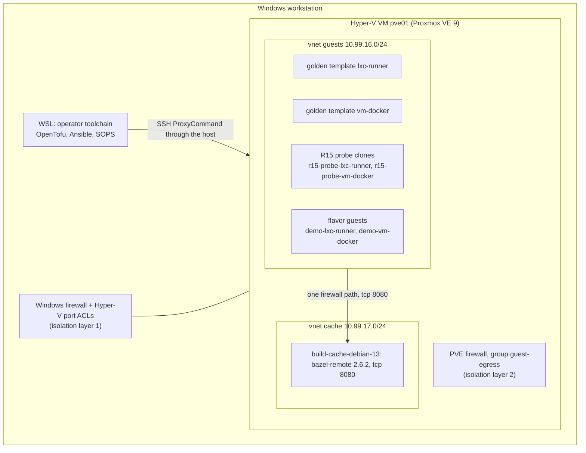

# Homelab CI platform on Proxmox VE 9

A homelab built for learning: Proxmox VE 9 runs as a Hyper-V VM on a Windows workstation, is rebuilt entirely from code, and is meant to host single-use CI runners. The repository holds the code, the measured evidence and what was learned, so it can be read, forked and developed further.

State: the host, isolation, golden templates, build cache and flavor-sized guests are built and measured; the runner pool controller and the steps after it are handed off. The phase table is in [`docs/handoff/README.md`](docs/handoff/README.md). CI runs on GitHub-hosted runners until the pool exists ([ADR 0054](docs/adr/0054-run-ci-on-hosted-runners-until-the-runner-pool-exists.md)).

## Architecture

| Part | What it is | Decision |
|---|---|---|
| Host VM | Gen2 Hyper-V VM, 12 vCPU, 20 GiB static RAM, 128 GiB dynamic VHDX, internal switch plus WinNAT | ADR 0003, 0006 |
| Isolation (requirement R15: runners reach no private network) | Two layers: Hyper-V extended port ACLs with a Windows Firewall rule, and the classic PVE firewall with a `guest-egress` security group. Runner guests reach the internet and the cache path only | ADR 0007, 0027, 0028 |
| IaC | OpenTofu (`bpg/proxmox`) for SDN, guests and template downloads; Ansible for OS, firewall files, the API identity and the template framework; state local and encrypted | ADR 0012, 0013, 0025 |
| Secrets | SOPS + age, one file per consumer and host, one writer each | ADR 0009, 0033 |
| Guest network | SDN zone `hlab` with vnets `guests` and `cache`, source-NATed, static addresses, port isolation on `guests` | ADR 0030, 0045 |
| Golden templates | `lxc-runner` and `vm-docker`, built on the host by a root orchestrator, two versions kept, one-command rollback, weekly rebuild | ADR 0038 to 0044 |
| Flavor guests | `scripts/iac/new-guest.sh` creates a guest sized by a cloud flavor such as `aws/t3.medium`, named `<role>-<class>-v<N>` and tagged with its flavor and source template | ADR 0055 |
| Build cache | `bazel-remote` in container `build-cache-debian-13` on the `cache` vnet; anonymous reads, one writer credential, content-addressed keys, outputs restored only on an exact match | ADR 0048 to 0050 |
| Evidence and knowledge | Sanitized transcripts per phase, a defect list and a test catalogue, published from the operator's machine | ADR 0052 |

Measured results: [`docs/handoff/results.md`](docs/handoff/results.md). Test coverage: [`docs/knowledge/coverage.md`](docs/knowledge/coverage.md).

## Repository layout

| Path | Purpose |
|---|---|
| [`iac/`](iac/README.md) | Inventory, Ansible, OpenTofu, secrets, runner-class policy |
| [`scripts/hyperv/`](scripts/hyperv/README.md) | Windows side: create and operate the `pve01` VM, isolation layer 1 |
| `scripts/iac/` | Wrappers: `ansible.sh`, `tofu.sh`, `render-ssh-config.sh`, `cache-writer-secret.sh`, `new-guest.sh` |
| `scripts/bootstrap/` | `operator-toolchain.sh`: pinned, hash-verified tools for WSL |
| `scripts/ci/build_cache/` | Build-cache client (domain, application, adapters) |
| `scripts/evidence/` | `publish.py`: sanitized evidence publisher and checker |
| `scripts/apps/` | Affected-test selector for the .NET sample solution |
| `tests/` | Isolation and role tests, cache client, evidence and Hyper-V (Pester) tests, selector harness |
| `apps/` | Sample workloads that the CI runs (see [`apps/README.md`](apps/README.md)) |
| `standard/` | The scorecard definition, its checks and records ([`standard/README.md`](standard/README.md)) |
| `.github/workflows/` | CI: IaC gate, cache client, evidence gate, Hyper-V tests, secret scan, scorecard, SDET pipeline |
| `docs/adr/` | Architecture decision records; index in [`docs/adr/README.md`](docs/adr/README.md) |
| `docs/platform/requirements.md` | Requirements, measured constraints, decision log |
| `docs/evidence/` | Sanitized run transcripts per phase, each with an `INDEX.md` |
| `docs/knowledge/` | Defects only the real host exposed, the test catalogue, coverage |
| `docs/handoff/` | What is not built and how to continue |
| `wiki/` | Pages mirrored to the GitHub wiki |

## Build order

Follow [`RUNBOOK.md`](RUNBOOK.md) section 2, "Build from zero". Prerequisites: a Windows 11 Pro workstation with virtualization on and a WSL Debian distribution, an age identity, an SSH key pair and the three operator SOPS files (runbook 2.1). A reader who was not part of this work starts with [`docs/handoff/README.md`](docs/handoff/README.md).

## Tests

Commands without a host: [`RUNBOOK.md`](RUNBOOK.md) 4.1, "Offline suites (no host)". [`docs/knowledge/test-catalogue.md`](docs/knowledge/test-catalogue.md) lists every test with what it proves, its command and its CI job; a claim only the real host can prove is marked there and backed by `docs/evidence/`.

## Project rules

Contribution and agent rules are in [`AGENTS.md`](AGENTS.md). In short: neutral, English-only artifacts (ADR 0002), one decision per ADR, no secrets on a command line, and every measured claim linked to a raw log or a run.
