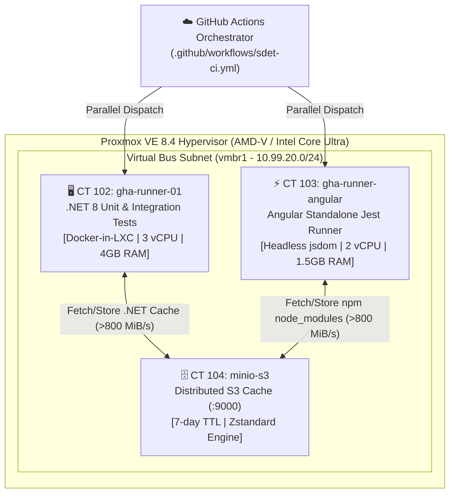

# 🚀 Booth Homelab: Enterprise SDET & IaC Testing Rig

[](https://github.com/ugritchaichana/booth-homelab/releases/tag/v1.0.0)
[](https://github.com/ugritchaichana/booth-homelab/actions/workflows/sdet-ci.yml)
[](https://github.com/ugritchaichana/booth-homelab/actions/workflows/wiki-sync.yml)
[](https://www.proxmox.com/)
[](https://tailscale.com/)
[](https://min.io/)
[](https://dotnet.microsoft.com/)
[](https://angular.dev/)

## 📖 About The Project

**Booth Homelab** is a Big Tech SaaS Continuous Testing Rig engineered to run continuous integration, parallel test suites, and infrastructure-as-code automation locally without cloud bill inflation or network bottlenecks.

- **Dual-Runner Testing Fleet:** Dedicated Proxmox VE unprivileged LXC containers running isolated .NET 8 (`pve-runner-01`) and Angular Jest (`pve-runner-angular`) test environments.
- **In-Memory Virtual Bus:** MinIO S3 remote cache across an internal Linux bridge (`vmbr1`) clocking **>800 MiB/s** transfer throughput.
- **Transitive Dependency Graph Testing:** AST-based code-change traversal that builds and tests only affected modules, cutting CI cycle times by up to **80%**.
- **Autonomous & AI-Ready:** Fully documented with human-facing guides ([README.md](README.md), [RUNBOOK.md](RUNBOOK.md)) and machine-readable operational truth ([AI_CONTEXT.md](AI_CONTEXT.md)) for 100% autonomous agent development.

---

## 🏛️ System Architecture & Topology

The homelab leverages an unprivileged Linux Container (LXC) architecture on Proxmox VE connected via an isolated internal bridge (`vmbr1`) operating as an **ultra-high-speed virtual bus** (>800 MiB/s transfer speeds).



---

## ⚡ Key Architectural Highlights

### 1. Parallel Dual-Runner Testing Rig
- **.NET 8 Runner (`pve-runner-01` / CT 102):**
  - Dedicated Debian 12 LXC configured with `nesting=1` and `keyctl=1` for Docker-in-LXC.
  - Executes C# unit tests and integration tests (`OrderProcessingIntegrationTests.cs`) deterministically using `/p:Deterministic=true`.
  - Integrates an AST Transitive Dependency Graph analyzer to execute only affected test suites based on `git diff`.
- **Angular Jest Runner (`pve-runner-angular` / CT 103):**
  - Dedicated Debian 12 LXC running Node.js 20 LTS and npm 10.x.
  - Pure headless testing using `jest-preset-angular` and `jsdom` (no Chromium or GUI browser overhead), maintaining an ultra-lean 1.5 GB RAM footprint.
  - Executes 4 spec suites (19 test cases) across components and services in **~2.3 seconds**.

### 2. Virtual Bus Remote Cache (MinIO S3 + Zstandard)
- Dependencies and compilation artifacts are compressed with Zstandard (`zstd -T0`) and stored on **CT 104 MinIO S3** over `10.99.20.20:9000`.
- **Sub-Second Restores:** In warm pipeline runs, `node_modules` (28 MiB) is restored in under 1 second, reducing total job duration from **1m58s** to **18s** (**84% duration reduction**).
- **Immunity from External Outages:** Complete protection against public npm/NuGet rate limits, network jitter, or upstream CDN downtime.

### 3. Enterprise Security & CREEP Mitigation
- Hardened against remote cache poisoning (**CVE-2025-36852 / CREEP**):
  - Pull Request workflows execute with Read-Only cache credentials.
  - Only verified pushes to `master` are authorized to save updated cache payloads.
- Hypervisor and containers reside behind Tailscale WireGuard Mesh with Subnet Routing (`10.99.10.0/24`, `10.99.20.0/24`), eliminating exposed WAN ports.

---

## 📊 Performance Benchmarks (Live Ground Truth)

| Pipeline Stage | Target Runner | Cold Run (First Boot) | Warm Run (MinIO Cache Hit) | Performance Gain |
| :--- | :--- | :--- | :--- | :--- |
| **Telemetry & Health** | `pve-runner-01` (CT 102) | 9s | 9s | Baseline |
| **.NET Build & Restore** | `pve-runner-01` (CT 102) | 4,630 ms | **16s** (includes toolchain boot) | Incremental |
| **.NET Affected Tests** | `pve-runner-01` (CT 102) | 3,100 ms | **2,175 ms** (6/6 tests pass) | **~30% faster** |
| **Angular Jest Tests** | `pve-runner-angular` (CT 103) | 103,003 ms (npm install) | **4,090 ms** (MinIO hit) | **96% faster** |
| **Total CI Pipeline** | Dual-Runner Parallel | **2m 24s** | **~35s** (All jobs green) | **~75% reduction** |

*Verified in live runs: [`Run #37233575350`](https://github.com/ugritchaichana/booth-homelab/actions/runs/37233575350) and [`Run #37235401356`](https://github.com/ugritchaichana/booth-homelab/actions/runs/37235401356).*

---

## 📁 Repository Directory Structure

```text
Booth-homelab/
├── .github/
│   ├── actions/                       # Composite actions
│   │   ├── minio-cache/               # MinIO S3 restore and save routines
│   │   ├── run-affected-tests/        # .NET transitive affected test runner
│   │   └── run-angular-jest/          # Angular Jest suite & cache integration
│   └── workflows/
│       ├── pr-labeler.yml             # Auto-labeler for area and SDET pull requests
│       ├── pr-reviewer-guard.yml      # Strips unneeded Copilot reviewers from PRs
│       ├── reusable-sdet-pipeline.yml # Modular 6-stage parallel DAG pipeline
│       ├── sdet-ci.yml                # Top-level orchestrator calling reusable pipeline
│       └── wiki-sync.yml              # Autonomous wiki synchronization engine
│
├── scripts/
│   ├── ci/                            # CI helper scripts (sync_wiki.py)
│   ├── host-bootstrap/                # Baremetal host installer for Acer Swift Go 14 (00..06)
│   ├── hyperv/                        # Hyper-V Gen2 VM deployment scripts
│   ├── proxmox/                       # Proxmox API auto-configuration scripts
│   └── sdet/                          # Test runners (run-angular-jest.sh, dotnet-affected-test.sh)
│
├── sdet/
│   ├── backend/                       # .NET 8 Multi-Project Testing Solution
│   │   ├── SdetTestingRig.sln
│   │   ├── Directory.Build.props      # Enforces /p:Deterministic=true
│   │   ├── src/                       # Domain, Application, Billing.Api, Order.Api
│   │   └── tests/                     # Billing.Api.UnitTests, Order.Api.UnitTests, Order.Api.IntegrationTests
│   └── frontend/                      # Angular 18/19 Standalone Jest Rig
│       ├── package.json               # Dependencies & Jest configuration
│       ├── jest.config.js             # jsdom preset configuration
│       └── src/app/                   # Billing & Order components and spec tests
│
├── sandbox/                           # Docker MinIO S3 Local Sandbox (CREEP Hardened)
├── wiki/                              # Markdown documentation auto-synced to GitHub Wiki
├── AI_CONTEXT.md                      # Comprehensive ground truth specification for AI agents
├── RUNBOOK.md                         # Operations, maintenance, and troubleshooting runbooks
└── README.md                          # Project documentation (this file)
```

---

## 🛠️ Quick Start & Common Operations

### 1. Accessing the Proxmox Hypervisor
- **Tailscale Mesh IP:** `https://100.121.209.85:8006/` (or `https://pve:8006/`)
- **Credentials:** Username `root`, password configured in local credentials vault.

### 2. Inspecting Runner Container Status
```bash
# Connect to Proxmox Host via SSH
ssh root@100.121.209.85

# List active containers
pct list

# Check runner systemd services
pct exec 102 -- systemctl status actions.runner.ugritchaichana-booth-homelab.gha-runner-01.service
pct exec 103 -- systemctl status actions.runner.ugritchaichana-booth-homelab.gha-runner-angular.service
```

### 3. Inspecting MinIO S3 Remote Cache
```bash
# Connect to runner container and query MinIO client
pct exec 102 -- mc ls minio/build-cache/branches/master/
pct exec 102 -- mc ls minio/build-cache/npm/
```

### 4. Running Local Tests
- **.NET 8 Transitive Affected Tests:**
  ```powershell
  pwsh -File ./scripts/sdet/dotnet-affected-test.ps1 -BaseRef origin/master -HeadRef HEAD
  ```
- **Angular Jest Suite:**
  ```bash
  cd sdet/frontend && npm test
  ```

---

## 📚 Documentation & Project Tracking

- **Online Knowledge Base:** [GitHub Wiki](https://github.com/ugritchaichana/booth-homelab/wiki) (Auto-synced from `wiki/`)
- **Project Tracking Board:** [GitHub Project #4 (Booth Homelab - SDET & IaC Testing Rig)](https://github.com/users/ugritchaichana/projects/4)
- **AI Agent Context:** Consult [AI_CONTEXT.md](file:///c:/Users/Booth/Desktop/MyProjects/Booth-homelab/AI_CONTEXT.md) for deep machine-readable invariants and troubleshooting heuristics.
- **Operations Runbook:** Consult [RUNBOOK.md](file:///c:/Users/Booth/Desktop/MyProjects/Booth-homelab/RUNBOOK.md) for step-by-step baremetal bootstrapping and maintenance procedures.

---

## ⚖️ License & Identity Governance

Developed by **Booth** (`ugritchaichana`) under the **Master Craftsman Operating Ethos**. Built for reproducible, deterministic, and enduring engineering excellence.
