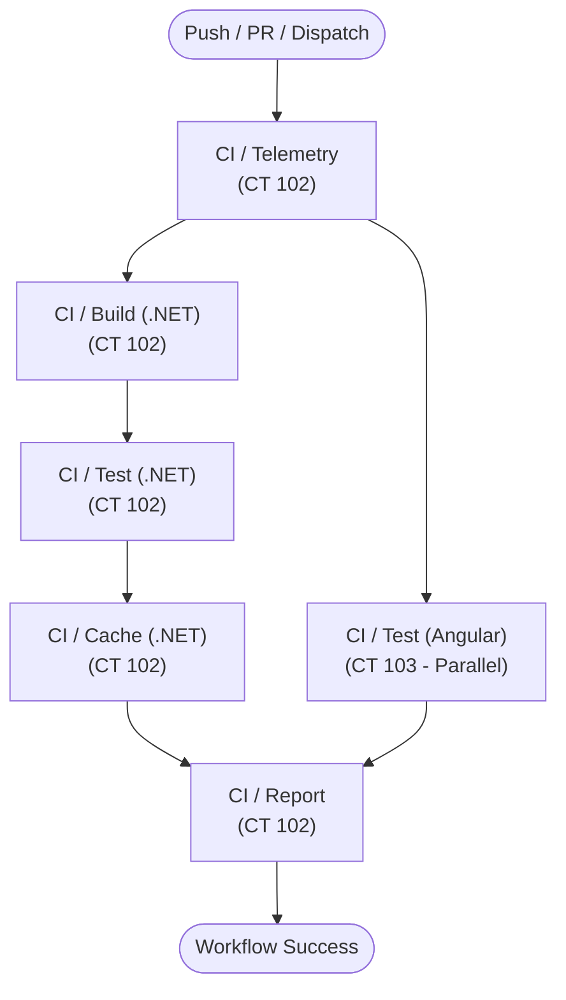

# Production RunBook: Homelab SDET & IaC Testing Rig

**Standard:** Continuous Testing Infrastructure Specification  
**Status:** Active  
**Revision:** Phase 2 Complete (Dual-Runner .NET 8 + Angular Jest Rig Live)  
**Target Environments:**
- **Environment A (Live Active Rig):** Windows 11 Workstation / AMD Ryzen 5 5600X / 32GB RAM / Hyper-V Nested Proxmox VE 8.4.0
- **Environment B (Target Baremetal Rig):** Dedicated x86_64 Node (Multi-Core 14C/18T Architecture / 16GB+ RAM / Wi-Fi & Ethernet)  
**Network Topography:** Restricted Network / CGNAT $\rightarrow$ Tailscale WireGuard Mesh $\rightarrow$ In-Memory Virtual Bus (`vmbr1`)

---

## Table of Contents

1. [Executive Architecture & Dual-Environment Matrix](#1-executive-architecture--dual-environment-matrix)
2. [Environment A Operations: Live Workstation Hyper-V & Nested Proxmox](#2-environment-a-operations-live-workstation-hyper-v--nested-proxmox)
3. [Environment B Operations: Baremetal Bootstrapping (Dedicated Node)](#3-environment-b-operations-baremetal-bootstrapping-dedicated-node)
4. [Container Fleet Architecture & Runner Lifecycle](#4-container-fleet-architecture--runner-lifecycle)
5. [MinIO S3 Remote Cache Administration & Disaster Recovery (CT 104)](#5-minio-s3-remote-cache-administration--disaster-recovery-ct-104)
   - [5.1 Bucket Hierarchy & TTL Policies](#51-bucket-hierarchy--ttl-policies)
   - [5.2 Disaster Recovery & Bucket Re-initialization SOP](#52-disaster-recovery--bucket-re-initialization-sop)
   - [5.3 Cache Purge for Cold Build Benchmarking](#53-cache-purge-for-cold-build-benchmarking)
   - [5.4 Enterprise Credential Hardening & Rotation SOP](#54-enterprise-credential-hardening--rotation-sop)
   - [5.5 Enterprise Password Complexity Standards (NIST SP 800-63B / CIS)](#55-enterprise-password-complexity-standards-nist-sp-800-63b--cis)
6. [CI/CD Pipeline Integration & GitHub Workflows](#6-cicd-pipeline-integration--github-workflows)
7. [Ephemeral Runner Lifecycle & Zero-Trace Decommissioning (IaC)](#7-ephemeral-runner-lifecycle--zero-trace-decommissioning-iac)
8. [Troubleshooting, Empirical Traps & Incident Decision Trees](#8-troubleshooting-empirical-traps--incident-decision-trees)
9. [Golden Templates (Phase 3 build framework)](#9-golden-templates-phase-3-build-framework)

---

## 1. Executive Architecture & Dual-Environment Matrix

The Homelab architecture is engineered for seamless operation across two complementary environments, sharing identical container configurations, CI/CD pipelines, and remote caching layers:

### Dual-Environment Comparison Matrix

| Dimension | Environment A (Live Active Workstation) | Environment B (Target Baremetal Node) |
| :--- | :--- | :--- |
| **Primary Role** | Active Dev/Test & Autonomous Verification Rig | Dedicated Standalone SDET Homelab Server |
| **Host Hardware** | AMD Ryzen 5 5600X (6C/12T), 32 GB DDR4 | Modern Multi-Core x86_64 Node (14C/18T Hybrid), 16 GB+ RAM |
| **Hypervisor Layer** | Windows 11 Pro Hyper-V (Gen 2 VM: `Proxmox-Lab`) | Proxmox VE 8.4 Baremetal on Debian 12 Minimal |
| **Virtualization Mode** | Nested AMD-V Virtualization Passthrough | Baremetal KVM / Kernel 6.8+ Enterprise Stack |
| **Network Uplink** | Hyper-V Internal NAT Switch (`172.29.16.1/20`) | Wi-Fi / Ethernet Adapter via Routed NAT |
| **Mesh Access** | Tailscale Mesh IP: `100.121.209.85:8006` | Tailscale Mesh IP (Subnet Router `10.99.10.0/24`) |
| **Internal Bridges** | `vmbr0` (`10.99.10.1`), `vmbr1` (`10.99.20.1`) | `vmbr0` (`10.99.10.1`), `vmbr1` (`10.99.20.1`) |
| **Storage Subsystem** | 50 GB VHDX (Ext4 LVM-Thin) | 512 GB PCIe Gen4 NVMe (Ext4 LVM-Thin — ZFS Banned) |

### Internal Network Topography

```
[ Tailscale Mesh / LAN Clients ]
               │
               ▼ (Port 8006 / SSH / Port 9001 Console)
   ┌────────────────────────────────────────────────────────┐
   │ Proxmox VE Host (Hyper-V VM or Baremetal Node)         │
   │ Host IP: 100.121.209.85 (Tailscale) / 172.29.21.44     │
   ├────────────────────────────────────────────────────────┤
   │ Management Subnet: vmbr0 (10.99.10.1/24)               │
   │ Virtual Bus Subnet: vmbr1 (10.99.20.1/24)              │
   │                                                        │
   │  ┌─────────────────┐ ┌─────────────────┐ ┌──────────┐ │
   │  │ CT 102          │ │ CT 103          │ │ CT 104   │ │
   │  │ gha-runner-01   │ │ gha-runner-ang..│ │ minio-s3 │ │
   │  │ (.NET 8 Runner) │ │ (Angular Jest)  │ │ (Cache)  │ │
   │  │ 10.99.20.101    │ │ 10.99.20.103    │ │ 10.99.20.20│
   │  └────────┬────────┘ └────────┬────────┘ └────▲─────┘ │
   │           │                   │               │       │
   │           └───────────────────┴───────────────┘       │
   │              Fast In-Memory Cache I/O (>800 MiB/s)    │
   └────────────────────────────────────────────────────────┘
```

---

## 2. Environment A Operations: Live Workstation Hyper-V & Nested Proxmox

Used for controlling, managing, and recovering the hypervisor host on the active Windows 11 workstation:

### 2.1 Hyper-V VM Lifecycle Commands (PowerShell Administrator)

```powershell
# 1. Check VM status
Get-VM "Proxmox-Lab"

# 2. Start hypervisor VM
Start-VM "Proxmox-Lab"

# 3. Save VM state for fast suspension
Save-VM "Proxmox-Lab"

# 4. Stop Proxmox gracefully
Stop-VM "Proxmox-Lab"

# 5. Verify Nested AMD-V Virtualization (must always be True)
Get-VMProcessor "Proxmox-Lab" | Select-Object VMName, ExposeVirtualizationExtensions

# 6. Enable Nested Virtualization if disabled
Set-VMProcessor -VMName "Proxmox-Lab" -ExposeVirtualizationExtensions $true

# 7. Verify and enable MAC Address Spoofing (required for virtual bridges vmbr0/vmbr1)
Get-VMNetworkAdapter "Proxmox-Lab" | Set-VMNetworkAdapter -MacAddressSpoofing On
```

### 2.2 Host Endpoint Access

- **Proxmox Web GUI:**
  - Via Tailscale Mesh: `https://100.121.209.85:8006/`
  - Via Hyper-V Internal NAT: `https://172.29.21.44:8006/`
- **MinIO Web Console:**
  - Via Tailscale Mesh: `http://100.121.209.85:9001/`
  - Via Hyper-V Internal NAT: `http://172.29.21.44:9001/`
- **Host Credentials:**
  - Username: `root` (Realm: `root@pam`)
  - Password: `[SECURE_VAULT]` (Injected via `PVE_PASS` environment variable)
  - PVE AI API Token ID: `root@pam!ai_agent`
  - PVE AI API Token Secret: `[SECURE_VAULT]` (Injected via `PVE_TOKEN_SECRET` environment variable)

> [!WARNING]
> **Host Credential Security Advisory:**  
> Plaintext passwords and API tokens must never be committed to git. Always inject credentials via environment variables and local vaults adhering to [Section 5.5 Enterprise Password Complexity Standards](#55-enterprise-password-complexity-standards-nist-sp-800-63b--cis).

### 2.3 Non-Interactive Host Execution via Python Paramiko

> [!IMPORTANT]
> **DO NOT run `ssh root@100.121.209.85` directly in Windows PowerShell:** The command hangs indefinitely on an interactive password prompt.  
> Always use Python Paramiko for deterministic, non-interactive execution:

```python
import paramiko

def exec_pve(cmd: str) -> str:
    ssh = paramiko.SSHClient()
    ssh.set_missing_host_key_policy(paramiko.AutoAddPolicy())
    ssh.connect('100.121.209.85', username='root', password='[LOCAL_VAULT_PW]')
    stdin, stdout, stderr = ssh.exec_command(cmd)
    out = stdout.read().decode('utf-8', errors='ignore')
    err = stderr.read().decode('utf-8', errors='ignore')
    ssh.close()
    return out if out else f"STDERR: {err}"

# Usage examples:
# print(exec_pve("pct list"))
# print(exec_pve("pct status 102"))
```

---

## 3. Environment B Operations: Baremetal Bootstrapping (Dedicated Node)

Used when migrating and bootstrapping the infrastructure onto a dedicated baremetal host node (e.g. x86_64 Mini-PC or Server Node with 16GB+ RAM):

### Step 3.1: Prepare Bootable USB & Bootstrap Bundle

```powershell
# 1. Run .NET Transitive Dependency Graph verification before packaging
powershell -ExecutionPolicy Bypass -File tests/verify-affected-graph.ps1

# 2. Package bootstrap bundle to USB drive (auto-converts line endings to LF)
powershell -ExecutionPolicy Bypass -File scripts/host-bootstrap/make-usb-pack.ps1 -TargetUsbDrive "E:\"
```
Resulting archive on USB: `pve-bootstrap-bundle.tar.gz`

### Step 3.2: Install Debian 12 Minimal on Baremetal Node

1. Create a Debian 12 Netinst bootable USB using Rufus (select **DD Image** mode).
2. Enter BIOS (press `F2` or `Del` at power-on):
   - **Disable Secure Boot** (Critical: prevents Proxmox kernel `bad shim signature` boot halts).
   - Set Function Key Behavior to Standard.
3. Proceed with Debian 12 installation:
   - Connect Wi-Fi or Ethernet cable.
   - **Partitioning:** Select **Guided LVM (Ext4)** (*NEVER select ZFS to prevent ARC memory starvation on 16GB RAM*).
   - **Software Selection:** Uncheck all desktop environments; select ONLY **SSH server** and **standard system utilities** (No Desktop GUI).

### Step 3.3: Run Bootstrap Stage 1 (Pre-Reboot)

```bash
sudo -i
mkdir -p /mnt/usb
mount /dev/sdb1 /mnt/usb
cd /mnt/usb/host-bootstrap
chmod +x *.sh

# Execute Stage 1
./bootstrap.sh --stage=1
```

**Stage 1 Execution Scope:**
- `00-preflight-check.sh`: Verifies multi-core CPU threads, RAM $\ge 14\text{GB}$, Wi-Fi interface (`wlo1`), confirms non-ZFS filesystem.
- `01-setup-hosts-and-repos.sh`: Configures `/etc/hosts` pointing to `10.99.10.1`, adds PVE 8.x No-Subscription repo, fetches GPG key with checksum verification (`7da6fe34168...`), installs `firmware-iwlwifi`.
- `02-install-pve-kernel.sh`: Installs `proxmox-default-kernel` (Kernel 6.8+ for full hardware scheduler support) and updates GRUB.

### Step 3.4: Reboot and Run Bootstrap Stage 2 (Post-Reboot)

```bash
# Reboot into PVE Kernel
reboot

# After reboot, verify kernel version:
uname -r # Expected: 6.8.x-pve

# Execute Stage 2
cd /mnt/usb/host-bootstrap
./bootstrap.sh --stage=2
```

**Stage 2 Execution Scope:**
- `03-install-pve-core.sh`: Configures Postfix non-interactively, installs `proxmox-ve` and `chrony`, purges legacy Debian 6.1 kernel, removes `os-prober`.
- `04-configure-routed-network.sh`: Detects network interface (`wlo1`), writes Routed NAT configuration to `/etc/network/interfaces`, sets up IP forwarding and masquerading for `10.99.10.0/24` and `10.99.20.0/24`, and adds PREROUTING port forwards for MinIO S3 API (9000) and Web Console (9001).
- `05-apply-hardware-stability.sh`: Disables lid close suspension (`HandleLidSwitch=ignore`), installs persistent Wi-Fi power-save kill switch service (`wifi-powersave-off.service`), enables `net.ipv4.ip_forward = 1`.
- `06-install-tailscale.sh`: Installs Tailscale, connects to mesh network with advertised subnet routes and Tailscale SSH enabled.

---

## 4. Container Fleet Architecture & Runner Lifecycle

### 4.1 Active Container Fleet

| VMID | Hostname | IP Address | Resource Limit | Role & Toolchain | Systemd Service Daemon |
| :--- | :--- | :--- | :--- | :--- | :--- |
| **CT 102** | `gha-runner-01` | `10.99.20.101` | 3 vCPU / 4.0 GB RAM / 20 GB Disk | **.NET 8 CI Runner**<br>Labels: `[self-hosted, linux, proxmox, dotnet]`<br>Toolchain: .NET 8.0.425, Docker-in-LXC (`nesting=1,keyctl=1`), `mc`, `zstd` | `actions.runner.ugritchaichana-booth-homelab.gha-runner-01.service` |
| **CT 103** | `gha-runner-angular` | `10.99.20.103` | 2 vCPU / 1.5 GB RAM / 12 GB Disk | **Angular Jest Runner**<br>Labels: `[self-hosted, linux, proxmox, angular]`<br>Toolchain: Node.js 20.20.2 LTS, npm 10.8.2, Pure Headless jsdom, `mc`, `zstd` | `actions.runner.ugritchaichana-booth-homelab.gha-runner-angular.service` |
| **CT 104** | `minio-s3` | `10.99.20.20` | 2 vCPU / 2.0 GB RAM / 15 GB Disk | **Distributed Remote Cache**<br>API: `:9000` / Console: `:9001`<br>Buckets: `build-cache`, `sdet-test-artifacts` | `minio.service` |

### 4.2 Runner Daemon Lifecycle Management

Execute these commands on the Proxmox Host via Paramiko or terminal console:

```bash
# 1. Check runner daemon service status
pct exec 102 -- systemctl status actions.runner.ugritchaichana-booth-homelab.gha-runner-01.service --no-pager
pct exec 103 -- systemctl status actions.runner.ugritchaichana-booth-homelab.gha-runner-angular.service --no-pager

# 2. Restart runner daemons to flush stuck worker processes
pct exec 102 -- systemctl restart actions.runner.ugritchaichana-booth-homelab.gha-runner-01.service
pct exec 103 -- systemctl restart actions.runner.ugritchaichana-booth-homelab.gha-runner-angular.service

# 3. Tail live runner logs
pct exec 102 -- journalctl -u actions.runner.ugritchaichana-booth-homelab.gha-runner-01.service -n 50 --no-pager
```

### 4.3 Runner Token Rotation & Re-enrollment SOP

> [!NOTE]
> GitHub Registration Tokens expire after 60 minutes. If re-enrolling or recovering an offline runner:

```bash
# 1. Fetch fresh registration token via GitHub CLI
RUNNER_TOKEN=$(gh api --method POST \
  -H "Accept: application/vnd.github+json" \
  /repos/ugritchaichana/booth-homelab/actions/runners/registration-token \
  --jq .token)
echo "Obtained token: $RUNNER_TOKEN"

# 2. Re-enroll CT 102 (.NET Runner):
pct exec 102 -- bash -c "
  cd /home/runner/actions-runner
  sudo ./svc.sh stop || true
  sudo ./svc.sh uninstall || true
  su - runner -c 'cd /home/runner/actions-runner && ./config.sh --url https://github.com/ugritchaichana/booth-homelab --token $RUNNER_TOKEN --name gha-runner-01 --labels self-hosted,linux,proxmox,dotnet --unattended --replace'
  sudo ./svc.sh install runner
  sudo ./svc.sh start
"

# 3. Re-enroll CT 103 (Angular Jest Runner):
pct exec 103 -- bash -c "
  cd /home/runner/actions-runner
  sudo ./svc.sh stop || true
  sudo ./svc.sh uninstall || true
  su - runner -c 'cd /home/runner/actions-runner && ./config.sh --url https://github.com/ugritchaichana/booth-homelab --token $RUNNER_TOKEN --name gha-runner-angular --labels self-hosted,linux,proxmox,angular --unattended --replace'
  sudo ./svc.sh install runner
  sudo ./svc.sh start
"
```

#### Ephemeral mode (opt-in, unverified)

Not exercised against the live host. Default provisioning is unchanged; `RUNNER_MODE` unset or `persistent` keeps the persistent runner (`config.sh` + `svc.sh install`).

With `RUNNER_MODE=ephemeral` a provisioner skips `config.sh` and the runner service, snapshots the stopped CT as `clean`, and installs a PVE-host supervisor (`homelab-ephemeral-runner@<CT>.service`). The supervisor loops: roll back to `clean`, start the CT, mint a single-use JIT runner config, run one job, repeat. The admin token stays on the host and never enters the CT.

Owner steps:

1. Create a fine-grained token restricted to this repository with Administration read/write.
2. On the PVE host as root, create `/etc/homelab/runner-supervisor.env` (mode 0600) holding `GITHUB_RUNNER_ADMIN_TOKEN='<token>'`. Never put the token on a command line or in the repo.
3. Re-provision with the mode set (`RUNNER_MODE=ephemeral python scripts/proxmox/provision-runner.py`, likewise `provision-angular-runner.py`; Windows cmd: `set RUNNER_MODE=ephemeral` first). The provisioner enables the supervisor only if the env file already exists; otherwise it prints the remaining step.
4. Delete the old persistent runner registrations under repository Settings > Actions > Runners.

Stop: `systemctl disable --now homelab-ephemeral-runner@102` (or `@103`), then re-provision without `RUNNER_MODE` to return to persistent mode.

Before enabling, note that `reusable-sdet-pipeline.yml` reuses the build job workspace in later jobs (`clean: false`), which a fresh-per-job runner does not keep.

### 4.4 Direct In-Container Test Execution (Offline Manual Debugging)

Execute tests directly inside the containers without triggering GitHub Actions:

```bash
# Run .NET 8 Unit & Integration Tests in CT 102:
pct exec 102 -- su - runner -c "
  cd /home/runner/actions-runner/_work/booth-homelab/booth-homelab/apps/backend
  dotnet test SdetTestingRig.sln --configuration Release --logger 'console;verbosity=normal'
"

# Run Angular Jest Standalone Tests in CT 103 (19 Tests / 4 Suites):
pct exec 103 -- su - runner -c "
  cd /home/runner/actions-runner/_work/booth-homelab/booth-homelab/apps/frontend
  npx jest --ci --colors --coverage
"
```

---

## 5. MinIO S3 Remote Cache Administration & Disaster Recovery (CT 104)

### 5.1 Bucket Hierarchy & TTL Policies

```
minio/build-cache/
├── branches/
│   └── master/
│       ├── <commit_sha>.tar.zst   (.NET build cache - ~73 MiB)
│       └── latest.tar.zst         (Latest pointer for cache restoration)
└── npm/
    └── node_modules.tar.zst       (Angular dependencies cache - ~28 MiB)

minio/sdet-test-artifacts/
├── backend/<run_id>/              (.trx test reports & coverage)
└── frontend/<run_id>/             (Jest coverage reports)
```

### 5.2 Disaster Recovery & Bucket Re-initialization SOP

If CT 104 is reprovisioned or cache data is purged:

```bash
# 1. Verify MinIO Server is running
pct exec 104 -- rc-service minio status

# 2. Configure a temporary admin alias on CT 102 (step 7 removes it; runners never hold root credentials)
pct exec 102 -- mc alias set minio-admin http://10.99.20.20:9000 "$MINIO_ROOT_USER" "$MINIO_ROOT_PASSWORD"

# 3. Create all required buckets
pct exec 102 -- mc mb -p minio-admin/build-cache
pct exec 102 -- mc mb -p minio-admin/sdet-test-artifacts

# 4. Keep buckets private (no anonymous access; runners use scoped IAM accounts)
pct exec 102 -- mc anonymous set none minio-admin/build-cache
pct exec 102 -- mc anonymous set none minio-admin/sdet-test-artifacts

# 5. Set lifecycle policy to auto-expire files older than 7 days (prevents disk bloat)
pct exec 102 -- mc ilm rule add --expire-days 7 minio-admin/build-cache
pct exec 102 -- mc ilm rule add --expire-days 7 minio-admin/sdet-test-artifacts

# 6. Verify upload/download over vmbr1 Virtual Bus
pct exec 102 -- bash -c "
  echo 'healthcheck' > /tmp/hc.txt
  mc cp /tmp/hc.txt minio-admin/build-cache/healthcheck.txt
  mc cp minio-admin/build-cache/healthcheck.txt /tmp/hc-download.txt
  cat /tmp/hc-download.txt
  mc rm minio-admin/build-cache/healthcheck.txt
"

# 7. Re-create the scoped IAM users, policies and runner reader aliases (the script also removes the admin alias)
python scripts/proxmox/configure_iam_cache_accounts.py
```

### 5.3 Cache Purge for Cold Build Benchmarking

```bash
# Purge all .NET and npm caches (needs the temporary admin alias; the runner reader and writer cannot delete):
pct exec 102 -- mc alias set minio-admin http://10.99.20.20:9000 "$MINIO_ROOT_USER" "$MINIO_ROOT_PASSWORD"
pct exec 102 -- mc rm --recursive --force minio-admin/build-cache/branches/master/
pct exec 102 -- mc rm --recursive --force minio-admin/build-cache/npm/
pct exec 102 -- mc alias remove minio-admin

# Verify bucket is empty:
pct exec 102 -- mc ls minio/build-cache/
```

### 5.4 Enterprise Credential Hardening & Rotation SOP

> [!WARNING]
> **Credential Hardening Disclaimer:**  
> All administrative credentials on CT 104 and Proxmox VE must be rotated and securely injected via environment variables. Never use default or predictable credentials in any shared or production environment.

#### Step 1: Rotate MinIO Root Administrative Credentials
To rotate root credentials on CT 104 (Alpine LXC):
```bash
# 1. Generate strong credentials adhering to the password standard
NEW_ROOT_USER="minio_admin_$(openssl rand -hex 4)"
NEW_ROOT_PASS="$(openssl rand -base64 24 | tr -dc 'a-zA-Z0-9!@#$%^&*()-_+=' | head -c 24)"

# 2. Update MinIO environment file on CT 104
pct exec 104 -- sh -c "cat <<EOF > /etc/conf.d/minio
MINIO_VOLUMES=\"/var/lib/minio/data\"
MINIO_OPTS=\"--address :9000 --console-address :9001\"
MINIO_ROOT_USER=\"$NEW_ROOT_USER\"
MINIO_ROOT_PASSWORD=\"$NEW_ROOT_PASS\"
EOF"

# 3. Restart MinIO service daemon
pct exec 104 -- rc-service minio restart

# 4. Update MinIO client alias on test runners (CT 102 and CT 103)
pct exec 102 -- mc alias set minio http://10.99.20.20:9000 "$NEW_ROOT_USER" "$NEW_ROOT_PASS"
pct exec 103 -- mc alias set minio http://10.99.20.20:9000 "$NEW_ROOT_USER" "$NEW_ROOT_PASS"
```

#### Step 2: Provision Granular IAM Service Accounts (Least Privilege)
Never distribute root administrative credentials to CI/CD runners. Instead, create scoped IAM Service Accounts:
```bash
# Create read-only service account for PR workflows
pct exec 102 -- mc admin user add minio sdet_pr_reader StrongPrReaderP@ss123!
pct exec 102 -- mc admin policy attach minio readonly --user sdet_pr_reader

# Create read-write service account for master pipeline
pct exec 102 -- mc admin user add minio sdet_ci_writer StrongCiWriterP@ss456!
pct exec 102 -- mc admin policy attach minio readwrite --user sdet_ci_writer
```

### 5.5 Enterprise Password Complexity Standards (NIST SP 800-63B / CIS)

All passwords, service keys, and access tokens used across the homelab infrastructure must comply with the following cryptographic and entropy standards:

| Criteria | Administrative / Root Accounts | CI/CD Service Accounts & API Keys |
| :--- | :--- | :--- |
| **Minimum Length** | **$\ge 20$ characters** | **$\ge 32$ characters** (or 256-bit entropy) |
| **Character Classes** | $\ge 4$ classes: `[A-Z]`, `[a-z]`, `[0-9]`, `[!@#$%^&*()-_+=[{]}\|:;,.<>?~]` | Cryptographically secure pseudo-random (`openssl rand -base64 32`) |
| **Banned Patterns** | Dictionary words, leetspeak (`P@ssw0rd`), sequential runs (`123456`, `qwerty`), project names (`booth`, `minio`, `proxmox`) | Shared secrets, hardcoded repository commits |
| **Rotation Cadence** | On team personnel change or suspected credential leak | 90 days or automated dynamic rotation |
| **Storage Standard** | Password vault / Secret manager (Bitwarden, Vault, KeePassXC) | GitHub Actions Encrypted Secrets / Environment Variables |

---

## 6. CI/CD Pipeline Integration & GitHub Workflows

### 6.1 Workflow Architecture & Job Graph

The CI/CD pipeline is structured as a modular DAG reusable dispatch action:
- `.github/workflows/sdet-ci.yml`: Entry point listening for `push`, `pull_request`, and `workflow_dispatch` events.
- `.github/workflows/reusable-sdet-pipeline.yml`: Core execution DAG structured into compact stages:



### 6.2 Pipeline Control via GitHub CLI

```bash
# Trigger manual pipeline execution (Workflow Dispatch):
gh workflow run sdet-ci.yml --repo ugritchaichana/booth-homelab

# List 3 most recent pipeline runs:
gh run list --repo ugritchaichana/booth-homelab -L 3

# View latest run summary:
gh run view --repo ugritchaichana/booth-homelab

# Inspect detailed job logs:
gh run view <run_id> --job=<job_id> --log --repo ugritchaichana/booth-homelab
```

### 6.3 Automation Safeguards

- **PR Labeler (`.github/workflows/pr-labeler.yml`):** Automatically attaches labels (`backend`, `frontend`, `infrastructure`, `sdet`) based on modified paths.
- **Reviewer Guard (`.github/workflows/pr-reviewer-guard.yml`):** Automatically removes Copilot reviewers from PRs.
- **Wiki Auto-Sync (`.github/workflows/wiki-sync.yml`):** Automatically synchronizes `wiki/` documentation to GitHub Wiki on pushes to `master`.

---

## 7. Ephemeral Runner Lifecycle & Zero-Trace Decommissioning (IaC)

For Phase 3 ephemeral runner provisioning:

### 7.1 Golden Template Creation (Packer)

Run container sanitization before converting to a golden template:
```bash
truncate -s 0 /etc/machine-id
rm -f /var/lib/dbus/machine-id
rm -f /etc/ssh/ssh_host_*
apt-get clean
rm -rf /var/lib/apt/lists/* /tmp/* /var/tmp/*

# Convert to Golden Template:
pct template 9001
```

### 7.2 OpenTofu Ephemeral Runner Provisioning

The OpenTofu root module that provisioned runners was replaced by the stacks under `iac/tofu/stacks/`, so `iac/tofu` itself is no longer a root module and `tofu apply` there does nothing. The ephemeral pool design is ADR 0016. Until the runner stack exists, the only stacks are `iac/tofu/stacks/proxmox-host` and `iac/tofu/stacks/r15-probe`, run through the wrapper (see `iac/tofu/README.md`):

```bash
bash scripts/iac/tofu.sh proxmox-host pve01 plan
```

### 7.3 Zero-Trace Decommissioning (Complete Host Reclamation)

When decommissioning the SDET rig to repurpose the host:

```bash
# 1. Backup Golden Template to external drive (Zstandard compressed)
mkdir -p /mnt/external_backup
mount /dev/sdX1 /mnt/external_backup
vzdump 9001 --compress zstd --dumpdir /mnt/external_backup/

# 2. Destroy containers and reclaim all storage
pct stop 102 && pct destroy 102
pct stop 103 && pct destroy 103
pct stop 104 && pct destroy 104
pct destroy 9001

# 3. Confirm clean storage status
pvesm status
```

---

## 8. Troubleshooting, Empirical Traps & Incident Decision Trees

### 8.1 The 6 Empirical Traps & Hard-Learned Solutions

```
┌──────────────────────────────────────────────────────────────────────────────────┐
│ THE 6 EMPIRICAL TRAPS & HARD-LEARNED SOLUTIONS                                  │
├──────────────────────────────────────────────────────────────────────────────────┤
│ 1. OPENSSH INTERACTIVE PROMPT HANG:                                              │
│    Windows PowerShell running 'ssh root@...' hangs on the password prompt.       │
│    --> Always use Python Paramiko with explicit credentials.                     │
│                                                                                  │
│ 2. COMPOSITE ACTION CHECKOUT ORDERING:                                           │
│    Do not invoke './.github/actions/...' before 'actions/checkout@v4'.           │
│    New runners do not have action YAML files on disk before checkout.            │
│    --> The first step of every job must always be actions/checkout@v4.           │
│                                                                                  │
│ 3. CONTAINER FILE INJECTION:                                                     │
│    Files in /tmp on Proxmox Host are not visible inside LXC containers.          │
│    --> Exclusively use 'pct push <vmid> <host_path> <container_path>'.           │
│                                                                                  │
│ 4. DEBIAN 12 USRMERGE BINARY PATH:                                               │
│    MinIO Client is at /bin/mc, which is a symlink to /usr/bin/mc.                │
│    --> Always resolve paths dynamically: $(command -v mc || echo '/usr/bin/mc') │
│                                                                                  │
│ 5. ANGULAR JEST PURE HEADLESS MEMORY CEILING:                                    │
│    Never install Chrome, Chromium, or Playwright inside CT 103.                  │
│    --> Use pure jsdom + jest-preset-angular to maintain a 1.5GB RAM ceiling.     │
│                                                                                  │
│ 6. .NET DOMAIN CURRENCY ASSERTION:                                               │
│    In Core.Domain, Money.Currency defaults to "USD", not "THB".                  │
│    --> Never assert "THB" unless explicitly passed to constructor.               │
└──────────────────────────────────────────────────────────────────────────────────┘
```

### 8.2 Comprehensive Incident Response Decision Tree

```mermaid
flowchart TD
    Issue["Issue Detected in SDET Rig"] --> Triage{"What is the symptom?"}

    Triage -- "Runner Shows Offline on GitHub" --> R1["Check Container & Daemon Status"]
    R1 --> R2["Run: pct list\nAre CT 102/103 running?"]
    R2 -- "Stopped" --> R3["Run: pct start 102 && pct start 103"]
    R2 -- "Running" --> R4["Check: systemctl status actions.runner..."]
    R4 -- "Failed / Exited" --> R5["Fetch fresh token with 'gh api .../registration-token'\nRun Re-enroll SOP (Section 4.3)"]

    Triage -- "CI/CD Cache Miss Loop or Connection Refused" --> C1["Inspect MinIO (CT 104)"]
    C1 --> C2["Run: pct exec 104 -- rc-service minio status"]
    C2 -- "Down" --> C3["Run: pct exec 104 -- rc-service minio restart"]
    C2 -- "Up" --> C4["Test: pct exec 102 -- mc ls minio/build-cache/\nVerify alias and buckets exist (Section 5.2)"]

    Triage -- "Cannot Access Proxmox Web GUI :8006" --> N1["Verify Host Connectivity"]
    N1 --> N2{"Which Environment?"}`
    N2 -- "Env A (Workstation)" --> N3["Check Hyper-V: Get-VM 'Proxmox-Lab'\nIf stopped: Start-VM 'Proxmox-Lab'"]
    N2 -- "Env B (Baremetal Node)" --> N4["Check Wi-Fi Captive Portal & Sleep\nRun: systemctl status wifi-powersave-off"]
    N3 --> N5["Check Tailscale:\ntailscale status (Verify 100.121.209.85 is online)"]
    N4 --> N5

    Triage -- "System Sluggish / Linux OOM Warning" --> M1["Inspect RAM Headroom"]
    M1 --> M2["Run: free -h on Host"]
    M2 --> M3{"Is ZFS in Use?"}
    M3 -- "Yes" --> M4["Cap ZFS ARC:\necho 2147483648 > /sys/module/zfs/parameters/zfs_arc_max"]
    M3 -- "No" --> M5["Reduce CT 102 RAM cap or stop idle containers"]
```

---

## 9. Golden Templates (Phase 3 build framework)

Two classes of runner template are built on the Proxmox host and cloned later by the runner stack: `lxc-runner` (VMID block 9200-9299) and `vm-docker` (VMID block 9300-9399). Decisions: [ADR 0038](docs/adr/0038-build-golden-templates-with-a-root-orchestrator-a-sandboxed-guest-step-and-in-guest-ansible.md) (how a build runs), [ADR 0039](docs/adr/0039-keep-templates-as-proxmox-templates-on-local-lvm-and-check-clone-origins-before-deleting-one.md) (storage, retention, verification), [ADR 0040](docs/adr/0040-version-templates-with-a-monotonic-number-a-root-only-current-tag-and-automatic-promotion.md) (versions, the `current` tag, rollback), [ADR 0036](docs/adr/0036-keep-templates-in-their-own-pool-and-let-the-provisioner-token-only-clone-them.md) (pool and clone-only privilege).

Every command below that starts with `$pve` runs from the operator's WSL shell. The host user is the automation user, which uses `sudo` for root (ADR 0023). On the host, root is the only identity that builds, promotes and rolls back; the API token cannot delete or retag a template.

```sh
pve="ssh -F ~/.config/homelab/ssh_config pve01"
```

### 9.1 Prerequisites

| Step | Who and where | Command or check |
|---|---|---|
| Framework installed | operator, WSL | `bash scripts/iac/ansible.sh site.yml -l pve01`, then a second run must end `changed=0` |
| Pool `templates` and the clone-only role exist | operator, WSL | `$pve sudo pveum acl list` shows `/pool/templates` with `HomelabTemplateClone` |
| Firewall group `guest-egress` and the guard timer exist | operator, WSL | `$pve sudo systemctl is-active homelab-guest-firewall-guard.timer` prints `active` |
| Base images are on `local` | operator, WSL | the file names are `base` of each class in `iac/ansible/roles/pve_templates/defaults/main.yml`; check with `$pve sudo pvesm list local` |
| Class content (the class `playbook.yml`) is installed under `/usr/local/share/homelab-template/bundles/<class>/` | operator, WSL | delivered by the class content changes; until then a build uses the minimal common playbook, which installs no toolchain and only describes the guest in the manifest |
| Free space | operator, WSL | `$pve sudo lvs -o lv_name,data_percent,metadata_percent pve/data` and `$pve df -h /var/lib/vz`; a build refuses above the thresholds in `pve_templates_thresholds` |

### 9.2 Build a version

```sh
$pve sudo systemctl start --no-block homelab-template-build@lxc-runner.service      # or vm-docker
$pve sudo journalctl -f -u homelab-template-build@lxc-runner.service -u homelab-template-guest@build.service -u homelab-template-guest@verify.service
```

Use the unit rather than the bare command: the unit writes the failure marker through `OnFailure=`. The same build by hand is `$pve sudo homelab-template build lxc-runner`.

What the journal shows, in order: `PREFLIGHT ok` (thin-pool and storage numbers), `LEFTOVER` (a guest from a crashed build, destroyed), `BUILD start ... version=v<N> vmid=<id>`, `READBACK ok ... before first start` (every network, firewall and guest-shape attribute matched), `START`, the guest step's lines (`guest-step: MANIFEST-DIFF ...`), `GATE ok ... manifest_sha256=...`, `READBACK ok ... template`, `VERIFY ok clone=<id> is a linked clone`, `TAGS`, `PROMOTED class=... v<old> -> v<new>`, `RETENTION destroyed|kept`. A failure ends with `FAILED` or `REFUSED` and the reason.

### 9.3 Status

```sh
$pve sudo homelab-template status
```

One line per class: `class=lxc-runner current=v3 vmid=9204 name=tmpl-lxc-runner-v3 previous=v2 last_build=...`. Exit 0 only when every class has exactly one `current`. `class=<c> ERROR current-count=0` or `=2` means consumers refuse that class; `MISMATCH recorded=<n>` means the tags differ from the root state (run `repair`, section 9.5). The same data from the API: `$pve sudo pvesh get /cluster/resources --type vm --output-format json`, filtered on the tag `homelab-template`.

### 9.4 Roll back

```sh
$pve sudo homelab-template rollback lxc-runner
$pve sudo homelab-template status lxc-runner
```

The command swaps `current` and `previous` and journals `ROLLBACK class=... current v<a> -> v<b>`. A second `rollback` swaps back. The next build promotes on top of the rolled-back version, and retention keeps that version and retires the one rolled back from. Running clones are not touched.

### 9.5 Recover a failed build

1. The marker: `$pve sudo ls /var/lib/homelab/templates/failed/`. Read the cause: `$pve sudo journalctl -u homelab-template-build@<class>.service -n 200` and, for the guest step, `$pve sudo journalctl -u homelab-template-guest@build.service -n 200`.
2. Match the last `FAILED` or `REFUSED` line:

| Line says | Meaning | Action |
|---|---|---|
| `REFUSED thin pool ... is above` or `storage local has ... GiB free` | space guard | free space (delete unused guests or backups), then rebuild |
| `REFUSED another homelab-template run holds the lock` | a build is running | `$pve sudo systemctl status homelab-template-build@<class>.service`; wait for it |
| `pre-start read-back differs: ...` | the guest was created with a setting that differs from policy; it was never started and is destroyed | fix the named setting in the role or `iac/policy/runner-class.yml`, converge, rebuild |
| `pass marker ... missing`, `guest-step: in-guest run.sh exited` or `SCAN FAILED` | the in-guest build or secret scan failed; nothing was converted | read the guest-step journal lines above it, fix the class content, rebuild |
| `not a linked clone` or `clone check differs` | verification failed; the new template was destroyed | read the line, rebuild |
| `promotion recorded in state but the tag move failed` | state moved, tags did not | `$pve sudo homelab-template repair <class>`, then `status` |

3. Leftover guests need no manual cleanup: the next build destroys any non-template guest in the class block. To look first: `$pve sudo qm list` and `$pve sudo pct list`.
4. Rebuild with the unit from section 9.2. A success removes the failure marker.

### 9.6 Where things live

| What | Where (on pve01) |
|---|---|
| Orchestrator, configuration | `/usr/local/sbin/homelab-template`, `/etc/homelab-template/config.json` (rendered by the role, do not edit) |
| Root state, manifests, failure markers | `/var/lib/homelab/templates/<class>.json`, `manifests/<class>/v<N>.json`, `failed/<class>` |
| Guest-facing step and its work directory | `/usr/local/libexec/homelab-template/guest-step`, `/var/lib/homelab/template-work` (the key lives here only while a build runs) |
| Units | `homelab-template-build@<class>.service`, `homelab-template-guest@build.service`, `homelab-template-failure@<class>.service`; no timer yet |

### 9.7 Checks without a host

```sh
bash tests/isolation/test-template-build.sh
bash tests/isolation/test-template-guest-step.sh
bash tests/isolation/test-template-finalize.sh
bash tests/isolation/test-template-units.sh
```

They run the real scripts against fakes of `pvesh`, `qm`, `pct`, `lvs`, `systemctl` and `ssh`, so they prove the logic and the unit file, not Proxmox's behaviour. The host proof (a build of each class, a rollback, the 403 checks with the provisioner token) is a later step; the arguments of `qm create --import-from`, `qm resize`, `pct create --ssh-public-keys` and the tag edit on a template are unverified until then.


### 9.8 Host integration: bundles, base images, snippets content, weekly rebuild

Role `pve_templates` (`iac/ansible/roles/pve_templates`), run on the Proxmox host from the repository root. Decision: ADR 0041.

#### 9.8.1 Converge (role pve_templates, as root through Ansible)

    bash scripts/iac/ansible.sh iac/ansible/playbooks/site.yml -l pve01

The converge:
- deploys every `files/bundles/<class>/` to `/usr/local/share/homelab-template/bundles/<class>/` (root-owned);
- downloads each class base image and fails on a sha512 mismatch;
- adds `snippets` to the content of storage `local`, keeping the existing types;
- installs and enables the weekly timer;
- starts the build of any class whose `versions.yml` changed, without waiting (the first converge starts every class).

Check storage content:

    pvesm config local

The `content` line must hold `snippets` and still hold `iso,vztmpl,backup,import`.

Check the images:

    ls -l /var/lib/vz/template/cache/ /var/lib/vz/import/

#### 9.8.2 See the timer and the last build

    systemctl list-timers homelab-template-weekly.timer
    systemctl status homelab-template-weekly.service
    journalctl -u 'homelab-template-build@*' -u homelab-template-weekly.service --since "7 days ago"
    journalctl -u homelab-template-build@lxc-runner.service -n 200
    systemctl list-units 'homelab-template-failure@*' --all

A build that failed leaves a `homelab-template-failure@<class>.service` run; the weekly service itself still ends green.

Run one class by hand (root, on the host):

    systemctl start --no-block homelab-template-build@<class>.service

#### 9.8.3 Bump a base image pin

1. Find the new file and its sha512 from the vendor index (`SHA512SUMS` next to the Debian cloud image, the `aplinfo` index of the Proxmox template mirror). Debian images: use a dated directory, never `latest`.
2. Edit `pve_templates_base_images` in `iac/ansible/roles/pve_templates/defaults/main.yml` (`url`, `sha512`) and `base:` in `pve_templates_classes` so the file name matches. The role asserts that the url file name equals the base volume name.
3. Open a PR; after merge run the converge from step 1. The old image file stays on the host until removed by hand; delete it only after the class built from the new one.
4. Bump the class `versions.yml` when the new image should produce a new template; the converge then starts that build.

### 9.9 Bump a pinned toolchain in the lxc-runner template

Role: operator with write access to the repository. All files are under `iac/ansible/roles/pve_templates/files/bundles/lxc-runner/`. Edit only `versions.yml` (plus `scan-allowlist.txt` when the scan asks). Work on a branch and open a pull request; the repository CI runs the content test.

Each bump changes three fields together: `version`, `url`, and the hash.

1. .NET SDK (entries `dotnet_sdk_8`, `dotnet_sdk_10`).
   - Role: operator. Command: `curl -fsSL https://builds.dotnet.microsoft.com/dotnet/release-metadata/8.0/releases.json -o releases-8.0.json` (use `10.0` for the other).
   - Read the hash and url: `jq -r '.releases[0].sdk.files[] | select(.rid=="linux-x64" and (.name|test("tar.gz"))) | .url, .hash' releases-8.0.json`. The hash is sha512; put it in `sha512:`.
   - Check the file yourself after download: `sha512sum dotnet-sdk-<version>-linux-x64.tar.gz` must equal the pinned value. Signature check: Microsoft publishes the hash inside the metadata served over TLS from its own host; the pin is that hash.
   - .NET 8 end of support is 2026-11-10 (`end_of_support.dotnet_sdk_8`). After that date, remove `dotnet_sdk_8` and the matching line in the playbook assert in the same pull request, after the repository stops targeting 8.0.x.
2. Node 22 (entry `nodejs`).
   - Command: `curl -fsSLO https://nodejs.org/dist/latest-v22.x/SHASUMS256.txt` and `curl -fsSLO https://nodejs.org/dist/latest-v22.x/SHASUMS256.txt.asc`. Read the version from the file names, then pin by exact version, never by the `latest-v22.x` path: url `https://nodejs.org/dist/v<version>/node-v<version>-linux-x64.tar.gz`.
   - Signature: import the release keys listed in the `nodejs/release-keys` repository, then `gpg --verify SHASUMS256.txt.asc SHASUMS256.txt`. Do this at pin time on the operator machine, never on pve01.
   - Hash: `grep 'node-v<version>-linux-x64.tar.gz$' SHASUMS256.txt` (sha256) goes in `sha256:`.
3. `actions/runner` (entry `actions_runner`).
   - Command: `gh api repos/actions/runner/releases/latest --jq .body` and take the sha256 between `BEGIN SHA linux-x64` and `END SHA linux-x64`. Url: `https://github.com/actions/runner/releases/download/v<version>/actions-runner-linux-x64-<version>.tar.gz`.
   - The service stops queuing jobs to a runner more than 30 days behind a critical release, so keep the weekly rebuild running and bump within the month.
4. Run the check locally (Linux or WSL): `bash tests/isolation/test-template-content.sh`. It must end with `OK:`.
5. If the build later stops with `SCAN FAILED ... secret pattern: <path> sha256=<hash>` for a file inside a Node or runner directory, open the file. If it is the npm config help text or the definitions file with a placeholder key, add the line `<sha256>  <path>` to `scan-allowlist.txt` in the same pull request. Any other file is a finding: do not allowlist it.
6. Merge. The next template build picks the new `versions.yml` up because the build copies the whole `bundles/lxc-runner/` directory into the guest; trigger it with the build command the framework section of `RUNBOOK.md` gives, or wait for the weekly timer. The build fails when the installed versions differ from `versions.yml`; the promotion step prints the manifest diff against the previous version.
7. Verify the result: read the new version's manifest and check `toolchains` and `versions_sha256` equal `sha256sum versions.yml` of the merged commit.

Rollback of a bad bump: revert the pull request, or switch the class back with the framework's one-command rollback (`RUNBOOK.md`, golden templates).

Named gaps (not installed on purpose): `mc` (Phase 4 cache decision), `pwsh`, `gh`, Docker.

### 9.10 The vm-docker class

Content lives in `iac/ansible/roles/pve_templates/files/bundles/vm-docker/` (`versions.yml`, `daemon.json`, `playbook.yml`). Decision: ADR 0043. Build framework: ADR 0038, versioning and rollback: ADR 0040.

#### Bump the container engine (role: operator, on a workstation)

1. Find the current trixie versions: `apt-cache policy docker.io containerd runc` on a Debian 13 host after `apt-get update`.
2. Edit the three `version:` values in `bundles/vm-docker/versions.yml`.
3. `bash tests/isolation/test-template-content-vm.sh` (must print `all passed`).
4. Commit, open a PR, merge. The next scheduled rebuild (or a manual one) picks it up.

#### Bump the runner (role: operator, on a workstation)

1. Pick the release at https://github.com/actions/runner/releases; copy the `linux-x64` sha256 from the release notes.
2. Edit `version`, `url` and `sha256` of the `actions-runner` entry in `versions.yml` (the version appears in the URL twice).
3. Verify the hash yourself: `curl -sLO <url>` then `sha256sum <file>` equals the pinned value.
4. Run the test from the engine steps, then commit and merge.

#### Build (role: root on pve01)

`homelab-template build vm-docker`. A drift between installed versions and `versions.yml` fails the build before conversion.

#### Check the class works on a clone (role: operator with provisioner access, then root on the clone)

1. Clone the current `vm-docker` template to a test VMID in pool `homelab` (consumer procedure: ADR 0036).
2. Start it and log in as `runner`.
3. `docker run --rm hello-world` must print "Hello from Docker!".
4. `grep -cE 'svm|vmx' /proc/cpuinfo` must print 0.
5. `ls /opt/actions-runner/.runner /opt/actions-runner/.credentials 2>&1` must report both missing.
6. `ss -ltn | grep -c 2375` must print 0 (no TCP listener).
7. Destroy the test clone.

Decision record: ADR 0044 (with ADR 0036, 0039, 0040). Commands run from the operator's WSL shell at the repository root; `$pve` is `ssh -F ~/.config/homelab/ssh_config pve01`, as in section 9.

## 10. Consuming a template (OpenTofu)

A consumer never names a VMID. It asks the module `iac/tofu/modules/proxmox/template-source` for a class (`lxc-runner` or `vm-docker`) and gets the VMID of the one template that carries the marker `homelab-template`, the class and the tag `current`. The plan stops (nothing is created) unless all of these hold: exactly one guest matches, it is a template, it is a member of pool `templates`, and its VMID lies in the class block (9200-9299 and 9300-9399). A pin replaces `current` with the tag `v<N>` and is checked the same way.

### 10.1 Check what a consumer will resolve

| Step | Who and where | Command or check |
|---|---|---|
| See the host's own view of the rule | operator, WSL | `$pve sudo homelab-template status`: exit 0 and one `current=` per class means a consumer resolves both classes |
| Preview the consumer's resolution | operator, WSL | `bash scripts/iac/tofu.sh r15-probe pve01 plan` and read the `clone` lines of the two probe guests; the output `template_sources` lists class to VMID |
| Read an error | operator | `Expected exactly one <class> template ... found 0` means no `current` (a build or a tag move is in progress, or none was ever built); `found 2` means two guests carry the tag, run `homelab-template repair <class>`; `is not a template`, `is not a member of pool templates`, `is outside the VMID block` name the one rule that failed |

### 10.2 Pin a version

A pin makes a consumer clone version N whatever `current` says. The pinned version must still exist: retention keeps only `current` and `previous` (ADR 0039).

1. Find the versions that exist. Operator, WSL: `$pve sudo homelab-template status` (current and previous are named) and `$pve sudo qm list` / `$pve sudo pct list` (names `tmpl-<class>-v<N>`).
2. Set the pin for one run. Operator, WSL: `export TF_VAR_template_pins='{"lxc-runner":1}'` (several classes: `'{"lxc-runner":1,"vm-docker":2}'`), then `bash scripts/iac/tofu.sh r15-probe pve01 plan`. The `clone` source of the guest changes to the pinned VMID.
3. Apply it. Operator, WSL: `bash scripts/iac/tofu.sh r15-probe pve01 apply`. The guest is replaced, not edited in place, because the provider forces a new guest when the clone source changes.
4. To pin permanently, put the same map in the consumer's variables file in the repository and review it like any change. Remove the pin (`unset TF_VAR_template_pins`, or delete the line) to follow `current` again.

### 10.3 Roll back: the pin or the root command

| | Pin (`template_pins`) | Root command (`homelab-template rollback <class>`) |
|---|---|---|
| Who runs it | operator, WSL, in the consumer's variables | operator, on the host as root |
| What it moves | only the consumer that sets the pin | the `current` tag for every consumer that follows it |
| Needs host access | no (API read only) | yes |
| Survives a new build | yes: a new build promotes `current` but the pin holds | no: the next build promotes on top of the rolled-back version |
| Needs the old version to exist | yes, N must still be present | yes, it is `previous` by definition |
| Undo | remove the pin | `homelab-template rollback <class>` again swaps back |

Use the pin when one consumer must hold a version while the fleet moves on, or when you have no host access. Use the root command when the new `current` is bad for everyone: `$pve sudo homelab-template rollback lxc-runner`, then `$pve sudo homelab-template status lxc-runner` (section 9.4). After a root rollback, a consumer without a pin resolves the previous version on its next plan; a guest already cloned from the bad version keeps running until it is replaced (apply again).

## 11. Run the R15 probe on template clones

The probe guests (VMIDs 9101 and 9102) are linked clones of the current `lxc-runner` and `vm-docker` templates in pool `homelab`. The rest of the procedure (keygen, targets file, phases, teardown) is `iac/tofu/stacks/r15-probe/README.md` and `tests/isolation/README.md`; this section adds what changed.

Templates are sealed with sshd off (ADR 0038); the probe reaches its two clones through a probe-only channel, section 11.1.


### 11.1 Control channel into the probe clones

Decision record: ADR 0044 addendum. Templates stay sealed (ADR 0038); only the two probe clones get a channel. `$pve` is `ssh -F ~/.config/homelab/ssh_config pve01`.

| Step | Who and where | Command or check |
|---|---|---|
| Precondition | operator, WSL | storage `local` allows `snippets`: `$pve sudo pvesm status --content snippets` lists `local` |
| 1. Generate the key and the vendor-data snippet | operator, WSL | `bash scripts/iac/ansible.sh r15-verify.yml -l pve01 --tags r15_keygen`; it prints `TF_VAR_probe_ssh_public_key=...` and writes `/var/lib/vz/snippets/r15-probe-vendor.yaml` |
| 2. Check the snippet | operator, WSL | `$pve sudo cat /var/lib/vz/snippets/r15-probe-vendor.yaml` shows `#cloud-config` and the public key only |
| 3. Apply the probe stack | operator, WSL | `export TF_VAR_probe_ssh_public_key='ssh-ed25519 ...'` then `bash scripts/iac/tofu.sh r15-probe pve01 apply` |
| 4. Run a phase | operator, WSL | `bash scripts/iac/ansible.sh r15-verify.yml -l pve01 -e r15_phase=baseline -e r15_output_dir=<dir>`; the play opens the container's channel with `pct exec`, the VM's channel comes from the snippet |

- Run step 1 before step 3; without the file the VM clone fails to start.
- The key changes only if `/root/.ssh/r15_probe_ed25519` is deleted; if so, rerun step 1 and replace the VM (`tofu apply -replace=proxmox_virtual_environment_vm.probe`) because vendor data runs at first boot only.
- `pct exec` is used only for the probe guests in `probe.yml`, never for runners.
- Failure reading: `wait_for` timeout on 10.99.16.22:22 means the snippet was not applied (check `$pve sudo qm config 9102 | grep cicustom`); on 10.99.16.21:22 means the `pct exec` task did not start `ssh.service` (check its output).
- Rollback: `tofu destroy` of the stack; delete `/var/lib/vz/snippets/r15-probe-vendor.yaml` (contains only a public key).

### 11.2 Procedure

| # | Step | Who and where | Command or check |
|---|---|---|---|
| 1 | At least one version of each class is built and consumers resolve | operator, WSL | `$pve sudo homelab-template status` exits 0 |
| 2 | The base images are no longer fetched by this stack; nothing to download | operator | none; the stack has no `proxmox_download_file` |
| 3 | Create the ephemeral key on the host | operator, WSL | `bash scripts/iac/ansible.sh r15-verify.yml -l pve01 --tags r15_keygen`, then `export TF_VAR_probe_ssh_public_key='<printed key>'` |
| 4 | Create the clones | operator, WSL | `bash scripts/iac/tofu.sh r15-probe pve01 init`, then `bash scripts/iac/tofu.sh r15-probe pve01 apply` |
| 5 | Prove the clone source on the host | operator, WSL | `$pve sudo pct config 9101` and `$pve sudo qm config 9102` list no `template:`; `$pve sudo lvs -o lv_name,origin pve` shows the clone volumes with an `origin` of `base-<template vmid>-disk-N` |
| 6 | Run the baseline | operator, WSL | `bash scripts/iac/ansible.sh r15-verify.yml -l pve01 -e r15_phase=baseline -e r15_output_dir=<results directory>`; every `PROBE` row holds and `SUMMARY` exits 0 |
| 7 | Tear down | operator, WSL | `bash scripts/iac/tofu.sh r15-probe pve01 destroy`, then delete the private key on the host (`$pve sudo rm /root/.ssh/r15_probe_ed25519`). No `pvesm free` is needed any more: no downloaded volume exists |

Pin the probe to a version (to test the previous template): section 10.2 with the probe stack. A promoted new version replaces both probe guests on the next apply (the provider forces a new guest on a changed clone source); that is expected for this throwaway stack.

While a probe clone of version N exists, retention will refuse to delete version N (journal: `REFUSED` with the clone's volume). Destroy the probe (step 7) before expecting space back.

### 11.3 Checks without a host

```sh
export TF_VAR_state_passphrase=local-test-only-passphrase-not-a-secret-0123
tofu -chdir=iac/tofu/stacks/r15-probe init -backend=false
tofu -chdir=iac/tofu/stacks/r15-probe test
```

`tests/template_source.tftest.hcl` is the table of refusals (zero, two, non-template, outside the pool or block, unknown class, pin); `tests/policy.tftest.hcl` pins the clone sources and `full = false`.

---

*This RunBook is verified and maintained for deterministic operations across automated and manual workflows.*
