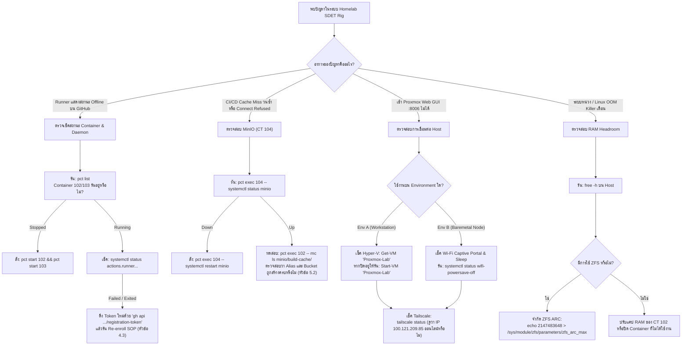

# Production RunBook: Homelab SDET & IaC Testing Rig

**Standard:** Big Tech SaaS Continuous Testing Standard  
**Lead Architects:** Booth (`ugritchaichana`) & Antigravity (Lead AI Co-Architect)  
**Revision:** Phase 2 Complete (Dual-Runner .NET 8 + Angular Jest Rig Live)  
**Target Environments:**
- **Environment A (Live Active Rig):** Windows 11 Workstation / AMD Ryzen 5 5600X / 32GB RAM / Hyper-V Nested Proxmox VE 8.4.0
- **Environment B (Target Baremetal Rig):** Dedicated x86_64 Node (Multi-Core 14C/18T Architecture / 16GB+ RAM / Wi-Fi & Ethernet)  
**Network Topography:** Restricted Network / CGNAT $\rightarrow$ Tailscale WireGuard Mesh $\rightarrow$ In-Memory Virtual Bus (`vmbr1`)

---

## สารบัญ (Table of Contents)

1. [Executive Architecture & Dual-Environment Matrix](#1-executive-architecture--dual-environment-matrix)
2. [Environment A Operations: Live Workstation Hyper-V & Nested Proxmox](#2-environment-a-operations-live-workstation-hyper-v--nested-proxmox)
3. [Environment B Operations: Baremetal Bootstrapping (Dedicated Node)](#3-environment-b-operations-baremetal-bootstrapping-dedicated-node)
4. [Container Fleet Architecture & Runner Lifecycle](#4-container-fleet-architecture--runner-lifecycle)
5. [MinIO S3 Remote Cache Administration & Disaster Recovery (CT 104)](#5-minio-s3-remote-cache-administration--disaster-recovery-ct-104)
6. [CI/CD Pipeline Integration & GitHub Workflows](#6-cicd-pipeline-integration--github-workflows)
7. [Ephemeral Runner Lifecycle & Zero-Trace Decommissioning (IaC)](#7-ephemeral-runner-lifecycle--zero-trace-decommissioning-iac)
8. [Troubleshooting, Empirical Traps & Incident Decision Trees](#8-troubleshooting-empirical-traps--incident-decision-trees)

---

## 1. Executive Architecture & Dual-Environment Matrix

ระบบ Homelab ถูกออกแบบให้ทำงานได้สองสภาพแวดล้อมอย่างราบรื่น โดยใช้ Container Configurations, CI/CD Pipeline และ Remote Cache เดียวกัน:

### Dual-Environment Comparison Matrix

| มิติ (Dimension) | Environment A (Live Active Workstation) | Environment B (Target Baremetal Node) |
| :--- | :--- | :--- |
| **บทบาทหลัก** | Active Dev/Test & Autonomous Verification Rig | Dedicated Standalone SDET Homelab Server |
| **ฮาร์ดแวร์แม่ข่าย** | AMD Ryzen 5 5600X (6C/12T), 32 GB DDR4 | Modern Multi-Core x86_64 Node (14C/18T Hybrid), 16 GB+ RAM |
| **ชั้น Hypervisor** | Windows 11 Pro Hyper-V (Gen 2 VM: `Proxmox-Lab`) | Proxmox VE 8.4 Baremetal on Debian 12 Minimal |
| **Virtualization Mode** | Nested AMD-V Virtualization Passthrough | Baremetal KVM / Kernel 6.8+ Enterprise Stack |
| **เครือข่าย Uplink** | Hyper-V Internal NAT Switch (`172.29.16.1/20`) | Wi-Fi / Ethernet Adapter ผ่าน Routed NAT |
| **Mesh Access** | Tailscale Mesh IP: `100.121.209.85:8006` | Tailscale Mesh IP (Subnet Router `10.99.10.0/24`) |
| **Internal Bridges** | `vmbr0` (`10.99.10.1`), `vmbr1` (`10.99.20.1`) | `vmbr0` (`10.99.10.1`), `vmbr1` (`10.99.20.1`) |
| **Storage Subsystem** | 50 GB VHDX (Ext4 LVM-Thin) | 512 GB PCIe Gen4 NVMe (Ext4 LVM-Thin — แบน ZFS) |

### สถาปัตยกรรมเครือข่ายภายใน (Internal Network Topography)

```
[ Tailscale Mesh / LAN Clients ]
               │
               ▼ (Port 8006 / SSH)
   ┌────────────────────────────────────────────────────────┐
   │ Proxmox VE Host (Hyper-V VM หรือ Laptop Baremetal)      │
   │ Host IP: 100.121.209.85 (Tailscale) / 172.29.21.44     │
   ├────────────────────────────────────────────────────────┤
   │ Management Subnet: vmbr0 (10.99.10.1/24)               │
   │ Virtual Bus Subnet: vmbr1 (10.99.20.1/24)              │
   │                                                        │
   │  ┌─────────────────┐ ┌─────────────────┐ ┌──────────┐ │
   │  │ CT 102          │ │ CT 103          │ │ CT 104   │ │
   │  │ gha-runner-01   │ │ gha-runner-ang..│ │ minio-s3 │ │
   │  │ (.NET 8 Runner) │ │ (Angular Jest)  │ │ (Cache)  │ │
   │  │ 10.99.20.101    │ │ 10.99.20.103    │ │ 10.99.20.20│
   │  └────────┬────────┘ └────────┬────────┘ └────▲─────┘ │
   │           │                   │               │       │
   │           └───────────────────┴───────────────┘       │
   │              Fast In-Memory Cache I/O (>800 MiB/s)    │
   └────────────────────────────────────────────────────────┘
```

---

## 2. Environment A Operations: Live Workstation Hyper-V & Nested Proxmox

ใช้สำหรับควบคุม จัดการ และกู้คืน Hypervisor Host บนเครื่อง Windows 11 Workstation ปัจจุบัน:

### 2.1 Hyper-V VM Lifecycle Commands (PowerShell Administrator)

```powershell
# 1. ตรวจสอบสถานะ VM
Get-VM "Proxmox-Lab"

# 2. เริ่มการทำงานของ Hypervisor VM
Start-VM "Proxmox-Lab"

# 3. บันทึก State เมื่อต้องการปิดเครื่องแบบเร็ว
Save-VM "Proxmox-Lab"

# 4. ปิดเครื่อง Proxmox แบบ Graceful Shutdown
Stop-VM "Proxmox-Lab"

# 5. ตรวจสอบ Nested AMD-V Virtualization (ต้องเป็น True เสมอ)
Get-VMProcessor "Proxmox-Lab" | Select-Object VMName, ExposeVirtualizationExtensions

# 6. เปิด Nested Virtualization หากถูกปิด
Set-VMProcessor -VMName "Proxmox-Lab" -ExposeVirtualizationExtensions $true

# 7. ตรวจสอบและเปิด MAC Address Spoofing (จำเป็นสำหรับ Virtual Bridge vmbr0/vmbr1)
Get-VMNetworkAdapter "Proxmox-Lab" | Set-VMNetworkAdapter -MacAddressSpoofing On
```

### 2.2 การเข้าใช้งาน Host Endpoints

- **Proxmox Web GUI:**
  - ผ่าน Tailscale Mesh: `https://100.121.209.85:8006/`
  - ผ่าน Hyper-V Internal NAT: `https://172.29.21.44:8006/`
- **Host Credentials:**
  - Username: `root` (Realm: `root@pam`)
  - Password: `[LOCAL_VAULT]` (`12345678` ในแล็บพัฒนา)
  - PVE AI API Token ID: `root@pam!ai_agent`
  - PVE AI API Token Secret: `d217551a-c823-4f09-a417-192304bd16cd`

### 2.3 การรันคำสั่งบน Host ผ่าน Python Paramiko (Non-Interactive Pattern)

> [!IMPORTANT]
> **ห้ามรัน `ssh root@100.121.209.85` บน Windows PowerShell โดยตรง:** คำสั่งจะติด Interactive Password Prompt และค้างไม่สิ้นสุด  
> ให้ใช้สคริปต์ Python Paramiko ในการส่งคำสั่งเสมอ:

```python
import paramiko

def exec_pve(cmd: str) -> str:
    ssh = paramiko.SSHClient()
    ssh.set_missing_host_key_policy(paramiko.AutoAddPolicy())
    ssh.connect('100.121.209.85', username='root', password='[LOCAL_VAULT_PW]')
    stdin, stdout, stderr = ssh.exec_command(cmd)
    out = stdout.read().decode('utf-8', errors='ignore')
    err = stderr.read().decode('utf-8', errors='ignore')
    ssh.close()
    return out if out else f"STDERR: {err}"

# ตัวอย่างการใช้งาน:
# print(exec_pve("pct list"))
# print(exec_pve("pct status 102"))
```

---

## 3. Environment B Operations: Baremetal Bootstrapping (Dedicated Node)

ใช้เมื่อต้องการย้ายระบบขึ้นติดตั้งบนเครื่อง Baremetal Node จริง (เช่น Mini-PC หรือ Server Node x86_64 16GB+ RAM):

### Step 3.1: การเตรียม Bootable USB & Bootstrap Bundle

```powershell
# 1. ทดสอบ .NET Transitive Dependency Graph Runner ก่อนแพ็กเกจ
powershell -ExecutionPolicy Bypass -File tests/verify-affected-graph.ps1

# 2. แพ็กชุดสคริปต์ลง USB Drive (แปลง Line Endings เป็น LF อัตโนมัติ)
powershell -ExecutionPolicy Bypass -File scripts/host-bootstrap/make-usb-pack.ps1 -TargetUsbDrive "E:\"
```
ไฟล์ที่ได้บน USB: `pve-bootstrap-bundle.tar.gz`

### Step 3.2: ติดตั้ง Debian 12 Minimal บน Baremetal Node

1. สร้าง Debian 12 Netinst USB ด้วย Rufus (เลือกโหมด **DD Image**).
2. เข้า BIOS ของเครื่อง Node (กด `F2` หรือ `Del` ตอนเปิดเครื่อง):
   - **Disable Secure Boot** (สำคัญมาก: ป้องกัน Kernel Proxmox เจอ `bad shim signature`).
   - ตั้งค่า Function Key Behavior เป็น Standard.
3. ดำเนินการติดตั้ง Debian 12:
   - เชื่อมต่อ Wi-Fi หรือเสียบสาย LAN.
   - **Partitioning:** เลือก **Guided LVM (Ext4)** (*ห้ามเลือก ZFS เป็นอันขาด เพื่อป้องกัน RAM ถูกแย่งไป 50%*).
   - **Software Selection:** ติ๊กออกทั้งหมด เหลือเพียง **SSH server** และ **standard system utilities** (ห้ามลง Desktop GUI).

### Step 3.3: การรัน Bootstrap Stage 1 (Pre-Reboot)

```bash
sudo -i
mkdir -p /mnt/usb
mount /dev/sdb1 /mnt/usb
cd /mnt/usb/host-bootstrap
chmod +x *.sh

# เริ่มรัน Stage 1
./bootstrap.sh --stage=1
```

**สิ่งที่สคริปต์ทำงานใน Stage 1:**
- `00-preflight-check.sh`: ยืนยัน CPU Meteor Lake 18 threads, RAM $\ge 14\text{GB}$, Wi-Fi interface (`wlo1`), ยืนยันว่าไม่มี ZFS.
- `01-setup-hosts-and-repos.sh`: กำหนด `/etc/hosts` ชี้ `10.99.10.1`, เพิ่ม PVE 8.x No-Subscription repo, ดึง GPG Key พร้อมตรวจสอบ Checksum `7da6fe34168...`, ติดตั้ง `firmware-iwlwifi`.
- `02-install-pve-kernel.sh`: ติดตั้ง `proxmox-default-kernel` (Kernel 6.8+ เพื่อให้ Intel Thread Director ทำงานสมบูรณ์) และอัปเดต GRUB.

### Step 3.4: รีบูตและรัน Bootstrap Stage 2 (Post-Reboot)

```bash
# รีบูตเข้าสู่ PVE Kernel
reboot

# หลังบูต ยืนยันเวอร์ชัน Kernel:
uname -r # Expected: 6.8.x-pve

# รัน Stage 2
cd /mnt/usb/host-bootstrap
./bootstrap.sh --stage=2
```

**สิ่งที่สคริปต์ทำงานใน Stage 2:**
- `03-install-pve-core.sh`: ตั้งค่า Postfix non-interactive, ติดตั้ง `proxmox-ve` และ `chrony`, ลบ Kernel 6.1 เดิมทิ้ง, ลบ `os-prober`.
- `04-configure-routed-network.sh`: ตรวจหา Wi-Fi interface (`wlo1`), เขียนคอนฟิก Routed NAT ลง `/etc/network/interfaces`, ตั้ง Masquerade ออก Subnet `10.99.10.0/24` และ `10.99.20.0/24`.
- `05-apply-hardware-stability.sh`: ปิดระบบ Sleep เมื่อพับฝา (`HandleLidSwitch=ignore`), ตั้ง Service ปิด Wi-Fi Power Save ถาวร (`wifi-powersave-off.service`), เปิด `net.ipv4.ip_forward = 1`.
- `06-install-tailscale.sh`: ติดตั้ง Tailscale, เชื่อมต่อ Mesh พร้อม Advertise Subnet Routes และเปิด Tailscale SSH.

---

## 4. Container Fleet Architecture & Runner Lifecycle

### 4.1 รายการ Container ประจำการ (Active Container Fleet)

| VMID | Hostname | IP Address | Resource Limit | บทบาทและ Toolchain | Systemd Service Daemon |
| :--- | :--- | :--- | :--- | :--- | :--- |
| **CT 102** | `gha-runner-01` | `10.99.20.101` | 3 vCPU / 4.0 GB RAM / 20 GB Disk | **.NET 8 CI Runner**<br>Labels: `[self-hosted, linux, proxmox, dotnet]`<br>Toolchain: .NET 8.0.425, Docker-in-LXC (`nesting=1,keyctl=1`), `mc`, `zstd` | `actions.runner.ugritchaichana-booth-homelab.gha-runner-01.service` |
| **CT 103** | `gha-runner-angular` | `10.99.20.103` | 2 vCPU / 1.5 GB RAM / 12 GB Disk | **Angular Jest Runner**<br>Labels: `[self-hosted, linux, proxmox, angular]`<br>Toolchain: Node.js 20.20.2 LTS, npm 10.8.2, Pure Headless jsdom, `mc`, `zstd` | `actions.runner.ugritchaichana-booth-homelab.gha-runner-angular.service` |
| **CT 104** | `minio-s3` | `10.99.20.20` | 2 vCPU / 2.0 GB RAM / 15 GB Disk | **Distributed Remote Cache**<br>API: `:9000` / Console: `:9001`<br>Buckets: `build-cache`, `sdet-test-artifacts` | `minio.service` |

### 4.2 Runner Daemon Lifecycle Management

รันคำสั่งเหล่านี้บน Proxmox Host ผ่าน Paramiko หรือ Console:

```bash
# 1. ตรวจสอบสถานะ Service ของ Runner ทั้งสองเครื่อง
pct exec 102 -- systemctl status actions.runner.ugritchaichana-booth-homelab.gha-runner-01.service --no-pager
pct exec 103 -- systemctl status actions.runner.ugritchaichana-booth-homelab.gha-runner-angular.service --no-pager

# 2. Restart Runner เมื่อต้องการล้าง Process ค้าง
pct exec 102 -- systemctl restart actions.runner.ugritchaichana-booth-homelab.gha-runner-01.service
pct exec 103 -- systemctl restart actions.runner.ugritchaichana-booth-homelab.gha-runner-angular.service

# 3. ดู Runner Logs สด
pct exec 102 -- journalctl -u actions.runner.ugritchaichana-booth-homelab.gha-runner-01.service -n 50 --no-pager
```

### 4.3 Runner Token Rotation & Re-enrollment SOP

> [!NOTE]
> GitHub Registration Token จะหมดอายุทุก 60 นาที หากต้อง Re-enroll หรือ Runner หลุดจาก GitHub:

```bash
# 1. ดึง Registration Token ใหม่ผ่าน GitHub CLI (บนเครื่อง Dev หรือ Host ที่มี gh CLI)
RUNNER_TOKEN=$(gh api --method POST \
  -H "Accept: application/vnd.github+json" \
  /repos/ugritchaichana/booth-homelab/actions/runners/registration-token \
  --jq .token)
echo "Token ที่ได้: $RUNNER_TOKEN"

# 2. Re-enroll CT 102 (.NET Runner):
pct exec 102 -- bash -c "
  cd /home/runner/actions-runner
  sudo ./svc.sh stop || true
  sudo ./svc.sh uninstall || true
  su - runner -c 'cd /home/runner/actions-runner && ./config.sh --url https://github.com/ugritchaichana/booth-homelab --token $RUNNER_TOKEN --name gha-runner-01 --labels self-hosted,linux,proxmox,dotnet --unattended --replace'
  sudo ./svc.sh install runner
  sudo ./svc.sh start
"

# 3. Re-enroll CT 103 (Angular Jest Runner):
pct exec 103 -- bash -c "
  cd /home/runner/actions-runner
  sudo ./svc.sh stop || true
  sudo ./svc.sh uninstall || true
  su - runner -c 'cd /home/runner/actions-runner && ./config.sh --url https://github.com/ugritchaichana/booth-homelab --token $RUNNER_TOKEN --name gha-runner-angular --labels self-hosted,linux,proxmox,angular --unattended --replace'
  sudo ./svc.sh install runner
  sudo ./svc.sh start
"
```

### 4.4 Direct In-Container Test Execution (Offline Manual Debugging)

สามารถสั่งรันเทสต์ตรงใน Container ได้ทันทีโดยไม่ต้องรันผ่าน GitHub Actions:

```bash
# รัน .NET 8 Unit & Integration Tests ใน CT 102:
pct exec 102 -- su - runner -c "
  cd /home/runner/actions-runner/_work/booth-homelab/booth-homelab/sdet/backend
  dotnet test SdetTestingRig.sln --configuration Release --logger 'console;verbosity=normal'
"

# รัน Angular Jest Standalone Tests ใน CT 103 (19 Tests / 4 Suites):
pct exec 103 -- su - runner -c "
  cd /home/runner/actions-runner/_work/booth-homelab/booth-homelab/sdet/frontend
  npx jest --ci --colors --coverage
"
```

---

## 5. MinIO S3 Remote Cache Administration & Disaster Recovery (CT 104)

### 5.1 ผังโครงสร้าง Bucket และ TTL Policies

```
minio/build-cache/
├── branches/
│   └── master/
│       ├── <commit_sha>.tar.zst   (.NET build cache - ~73 MiB)
│       └── latest.tar.zst         (Pointer ล่าสุดสำหรับ Cache Restore)
└── npm/
    └── node_modules.tar.zst       (Angular dependencies cache - ~28 MiB)

minio/sdet-test-artifacts/
├── backend/<run_id>/              (.trx test reports & coverage)
└── frontend/<run_id>/             (Jest coverage reports)
```

### 5.2 Disaster Recovery & Bucket Re-initialization SOP

หาก CT 104 ถูกสร้างใหม่หรือข้อมูล Cache เสียหาย:

```bash
# 1. ตรวจสอบว่า MinIO Server กำลังทำงาน
pct exec 104 -- systemctl status minio --no-pager

# 2. ตั้งค่า mc alias บน Host หรือ Runner (CT 102 / 103)
pct exec 102 -- mc alias set minio http://10.99.20.20:9000 minioadmin minioadmin

# 3. สร้าง Buckets ที่จำเป็นทั้งหมด
pct exec 102 -- mc mb -p minio/build-cache
pct exec 102 -- mc mb -p minio/sdet-test-artifacts

# 4. ตั้งค่า Lifecycle Policy ลบไฟล์เก่าเกิน 7 วันโดยอัตโนมัติ (ป้องกัน Disk เต็ม)
pct exec 102 -- mc ilm rule add --expire-days 7 minio/build-cache
pct exec 102 -- mc ilm rule add --expire-days 7 minio/sdet-test-artifacts

# 5. ทดสอบ Upload / Download ผ่าน vmbr1 Virtual Bus
pct exec 102 -- bash -c "
  echo 'healthcheck' > /tmp/hc.txt
  mc cp /tmp/hc.txt minio/build-cache/healthcheck.txt
  mc cp minio/build-cache/healthcheck.txt /tmp/hc-download.txt
  cat /tmp/hc-download.txt
  mc rm minio/build-cache/healthcheck.txt
"
```

### 5.3 การล้างแคชเพื่อทดสอบ Cold Build (Cache Purge)

```bash
# ล้างแคช .NET และ npm ทั้งหมด:
pct exec 102 -- mc rm --recursive --force minio/build-cache/branches/master/
pct exec 102 -- mc rm --recursive --force minio/build-cache/npm/

# ตรวจสอบว่า Bucket ว่างเปล่า:
pct exec 102 -- mc ls minio/build-cache/
```

---

## 6. CI/CD Pipeline Integration & GitHub Workflows

### 6.1 Workflow Architecture & Job Graph

ไปป์ไลน์ CI/CD ถูกจัดโครงสร้างเป็น Modular DAG แบบ Reusable Dispatch Action:
- `.github/workflows/sdet-ci.yml`: Entry point รับ event (`push`, `pull_request`, `workflow_dispatch`).
- `.github/workflows/reusable-sdet-pipeline.yml`: Core execution DAG แบ่ง Job เป็นสัดส่วนและตั้งชื่อสั้นกระชับ:


### 6.2 การควบคุมและตรวจสอบ Pipeline ผ่าน GitHub CLI

```bash
# รัน Pipeline แบบ Manual (Workflow Dispatch):
gh workflow run sdet-ci.yml --repo ugritchaichana/booth-homelab

# ตรวจสอบสถานะการรัน 3 ครั้งล่าสุด:
gh run list --repo ugritchaichana/booth-homelab -L 3

# ดูสรุปผลการรันครั้งล่าสุด:
gh run view --repo ugritchaichana/booth-homelab

# ดู Log ราย Job แบบละเอียด:
gh run view <run_id> --job=<job_id> --log --repo ugritchaichana/booth-homelab
```

### 6.3 Automation Safeguards

- **PR Labeler (`.github/workflows/pr-labeler.yml`):** ติด Labels (`backend`, `frontend`, `infrastructure`, `sdet`) ตามโฟลเดอร์ที่แก้ไขอัตโนมัติ.
- **Reviewer Guard (`.github/workflows/pr-reviewer-guard.yml`):** ถอด Copilot reviewers ออกจาก PR โดยอัตโนมัติ.
- **Wiki Auto-Sync (`.github/workflows/wiki-sync.yml`):** ซิงก์โฟลเดอร์ `wiki/` ขึ้นสู่ GitHub Wiki อัตโนมัติทุกครั้งที่มีการ Push ลงกิ่ง `master`.

---

## 7. Ephemeral Runner Lifecycle & Zero-Trace Decommissioning (IaC)

สำหรับโหมดการใช้งานแบบ Ephemeral Runners ใน Phase 3:

### 7.1 Golden Template Creation (Packer)

ก่อนเปลี่ยน Container เป็น Golden Template จะต้องรัน Sanitization Script:
```bash
truncate -s 0 /etc/machine-id
rm -f /var/lib/dbus/machine-id
rm -f /etc/ssh/ssh_host_*
apt-get clean
rm -rf /var/lib/apt/lists/* /tmp/* /var/tmp/*

# แปลงเป็น Golden Template:
pct template 9001
```

### 7.2 OpenTofu Ephemeral Runner Provisioning

```bash
cd iac/tofu
tofu init
tofu apply -auto-approve

# รัน Test Suite จนเสร็จสิ้น...

# ทำลาย Runner ทันทีหลังเสร็จงาน:
tofu destroy -auto-approve
```

### 7.3 Zero-Trace Decommissioning (การล้างเครื่อง 100%)

เมื่อเสร็จสิ้นการใช้งาน SDET Rig และต้องการนำเครื่อง Host ไปรันระบบอื่น:

```bash
# 1. สำรอง Template ออก External Drive (Zstandard Compressed)
mkdir -p /mnt/external_backup
mount /dev/sdX1 /mnt/external_backup
vzdump 9001 --compress zstd --dumpdir /mnt/external_backup/

# 2. ทำลาย Container และ Reclaim Storage ทั้งหมด
pct stop 102 && pct destroy 102
pct stop 103 && pct destroy 103
pct stop 104 && pct destroy 104
pct destroy 9001

# 3. ยืนยันว่า Storage ว่างสะอาด 100%
pvesm status
```

---

## 8. Troubleshooting, Empirical Traps & Incident Decision Trees

### 8.1 The 6 Empirical Traps (ข้อพึงระวังจากประสบการณ์จริง)

```
┌──────────────────────────────────────────────────────────────────────────────────┐
│ THE 6 EMPIRICAL TRAPS & HARD-LEARNED SOLUTIONS                                  │
├──────────────────────────────────────────────────────────────────────────────────┤
│ 1. OPENSSH INTERACTIVE PROMPT HANG:                                              │
│    Windows PowerShell รัน 'ssh root@...' จะค้างหน้า Password Prompt              │
│    --> ใช้ Python Paramiko with explicit password เสมอ                            │
│                                                                                  │
│ 2. COMPOSITE ACTION CHECKOUT ORDERING:                                           │
│    ห้ามเรียก './.github/actions/...' ก่อน 'actions/checkout@v4'                  │
│    เพราะ Runner ตัวใหม่ยังไม่มีไฟล์ action YAML อยู่บน Disk                       │
│    --> Step แรกของทุก Job ต้องเป็น actions/checkout@v4 เสมอ                      │
│                                                                                  │
│ 3. CONTAINER FILE INJECTION:                                                     │
│    ไฟล์ใน /tmp บน Proxmox Host จะมองไม่เห็นใน LXC Container                      │
│    --> ใช้คำสั่ง 'pct push <vmid> <host_path> <container_path>' เท่านั้น          │
│                                                                                  │
│ 4. DEBIAN 12 USRMERGE BINARY PATH:                                               │
│    MinIO Client อยู่ที่ /bin/mc ซึ่งเป็น Symlink ไป /usr/bin/mc                  │
│    --> ใน Script ให้หา path ผ่าน: $(command -v mc || echo '/usr/bin/mc')        │
│                                                                                  │
│ 5. ANGULAR JEST PURE HEADLESS MEMORY CEILING:                                    │
│    ห้ามติดตั้ง Chrome / Chromium / Playwright ลงใน CT 103 เด็ดขาด                │
│    --> ใช้ pure jsdom + jest-preset-angular เพื่อรักษาระดับ RAM 1.5GB            │
│                                                                                  │
│ 6. .NET DOMAIN CURRENCY ASSERTION:                                               │
│    ใน Core.Domain ค่าเริ่มต้นของ Money.Currency คือ "USD" ไม่ใช่ "THB"           │
│    --> อย่าเขียน Test Assert "THB" เว้นแต่จะ Set ใน Constructor ชัดเจน           │
└──────────────────────────────────────────────────────────────────────────────────┘
```

### 8.2 Comprehensive Incident Response Decision Tree



---

*RunBook ฉบับนี้ผ่านการตรวจสอบและทดสอบความถูกต้องตามมาตรฐาน Master Craftsman พร้อมสำหรับการปฏิบัติการทั้งโดยมนุษย์และระบบ AI แบบอัตโนมัติ 100%*
