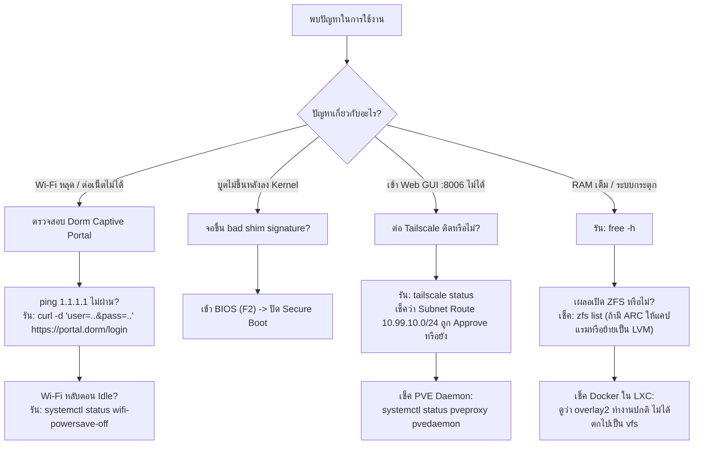

# Production RunBook: Homelab SDET & IaC Testing Rig
**Target Architecture:** Big Tech SaaS Continuous Testing Standard  
**Lead Architect:** Booth (Master Craftsman) & Antigravity (AGY)  
**Target Hardware:** Acer Swift Go 14 (`SFG14-73-54C7` / Core Ultra 125H / 16GB LPDDR5X / Wi-Fi 7)  
**Target Environment:** Dormitory Wi-Fi (CGNAT, AP Isolation, Captive Portal) $\rightarrow$ Tailscale WireGuard Mesh

---

## สารบัญ (Table of Contents)
1. [Executive Architecture & Constraint Matrix](#1-executive-architecture--constraint-matrix)
2. [Phase 1: Local Development & Verification (บนเครื่องปัจจุบัน)](#2-phase-1-local-development--verification)
3. [Phase 2: Baremetal Host Bootstrapping (นำไปลง Laptop จริง)](#3-phase-2-baremetal-host-bootstrapping)
4. [Phase 3: Ephemeral Runners & IaC Lifecycle (Packer + OpenTofu)](#4-phase-3-ephemeral-runners--iac-lifecycle)
5. [Phase 4: Big Tech SDET Pipeline Integration (.NET & Angular)](#5-phase-4-big-tech-sdet-pipeline-integration)
6. [Phase 5: Zero-Trace Decommissioning & Storage Archival](#6-phase-5-zero-trace-decommissioning--storage-archival)
7. [Troubleshooting & Incident Response Decision Tree](#7-troubleshooting--incident-response-decision-tree)

---

## 1. Executive Architecture & Constraint Matrix

| Component | Physical Constraint | Architectural Choice / Mitigation |
| :--- | :--- | :--- |
| **CPU** | Intel Core Ultra 125H (14C/18T: 4P + 8E + 2LP-E) | **Linux Kernel 6.8+ (Proxmox Default Kernel):** รองรับ Intel Thread Director เพื่อการ Schedule P/E/LP-E cores อย่างถูกต้อง ป้องกันความร้อนสะสม |
| **RAM** | **16 GB LPDDR5X (Soldered Onboard - เพิ่มไม่ได้)** | **100% Unprivileged LXC (แบน Full VM ทั้งหมด):** แคป RAM ใช้งานจริงไม่เกิน 14.0 GB เพื่อเหลือ 2.0 GB ให้ OS Buffer Cache ป้องกัน Linux OOM Killer |
| **Storage** | 512 GB PCIe Gen4 NVMe SSD | **Ext4 on LVM-Thin (แบน ZFS โดยเด็ดขาด):** ZFS ARC แย่ง RAM ไป 50% (8GB) ทำให้ Container ขาดแรม / ตั้ง MinIO 7-day TTL ลบ Logs อัตโนมัติ |
| **Network** | Wi-Fi 7 Intel AX1675 / BE200 (ไม่มีพอร์ต LAN) | **Routed Network + NAT (iptables Masquerade):** เนื่องจาก Wi-Fi บล็อก Layer-2 Bridge (`vmbr0`) จึงต้องทำ Routed NAT ออกสู่อินเทอร์เน็ต |
| **Environment** | หอพัก (CGNAT, AP Isolation, Captive Portal) | **Tailscale WireGuard Mesh + Subnet Router:** ทะลวง CGNAT และ Client Isolation สามารถเข้า Proxmox Web GUI (`:8006`) และ SSH ได้จากทุกที่ |
| **Form Factor** | โน้ตบุ๊กแบบพับฝา (Clamshell) | **Override systemd-logind:** ปิดระบบ Sleep เมื่อพับฝาจอ และปิด Wi-Fi Power Save ถาวรเพื่อให้อัปไทม์ 100% |

---

## 2. Phase 1: Local Development & Verification
*(ดำเนินการและผ่านการทดสอบแล้วบนเครื่องปัจจุบัน)*

### 2.1 การทดสอบ .NET Transitive Dependency Graph Runner
เพื่อพิสูจน์ว่าระบบจะไม่รันเทสต์แบบสุ่มสี่สุ่มห้า แต่จะตาม Dependency Tree (DAG) ลงไปเฉพาะโปรเจกต์ที่ได้รับผลกระทบ:

**คำสั่งรันชุดทดสอบ TDD อัตโนมัติ:**
```powershell
powershell -ExecutionPolicy Bypass -File tests/verify-affected-graph.ps1
```

**ผลการทดสอบ (Deterministic Telemetry):**
1. **Scenario 1 (Leaf Project Change):** แก้ไข `Billing.Api` $\rightarrow$ รันเฉพาะ `Billing.Api.UnitTests.csproj` (ข้าม `Order.Api`) `[PASS]`
2. **Scenario 2 (Root Domain Change):** แก้ไข `Core.Domain` $\rightarrow$ Traversal ผ่าน `Core.Application` $\rightarrow$ `Order.Api` $\rightarrow$ รันเฉพาะ `Order.Api.UnitTests.csproj` `[PASS]`
3. **Scenario 3 (Non-Code Change):** แก้ไข `README.md` $\rightarrow$ รัน 0 Suites จบการทำงานทันที `[PASS]`
4. **Scenario 4 (Live Execution):** คอมไพล์ด้วย `/p:Deterministic=true` รันเทสต์สำเร็จใน 1.12 วินาที และสร้างไฟล์ผลลัพธ์ `.trx` `[PASS]`

### 2.2 การแพ็กชุดสคริปต์ลง USB เพื่อนำไปติดตั้งบน Laptop
สร้างไฟล์ Deployment Bundle พร้อมแปลง Line Endings เป็น LF สำหรับ Linux:
```powershell
powershell -ExecutionPolicy Bypass -File scripts/host-bootstrap/make-usb-pack.ps1
# หรือระบุ Drive USB โดยตรง:
powershell -ExecutionPolicy Bypass -File scripts/host-bootstrap/make-usb-pack.ps1 -TargetUsbDrive "E:\"
```
ไฟล์ที่ได้: `pve-bootstrap-bundle.tar.gz`

---

## 3. Phase 2: Baremetal Host Bootstrapping (นำไปลง Laptop จริง)

### Step 2.1: ติดตั้ง Debian 12 Minimal บน Acer Swift Go 14
1. ดาวน์โหลดไฟล์ ISO: **Debian 12 Netinst (Bookworm)**
2. Flash ลง Flash Drive ด้วย Rufus (เลือกโหมด **DD Image**)
3. เสียบเข้า Acer Swift Go 14 และเปิดเครื่องเข้า BIOS (กด `F2`):
   - **Disable Secure Boot** (สำคัญมาก: เพื่อป้องกัน `bad shim signature` ใน Kernel Proxmox)
   - ปรับ Function Key เป็น Standard
4. เริ่มกระบวนการติดตั้ง Debian:
   - เชื่อมต่อ Wi-Fi หอพักในขั้นตอนติดตั้ง
   - **Partitioning Scheme:** เลือก **Manual** หรือ Guided **LVM (Ext4)**  
     *(คำเตือนขั้นวิกฤต: ห้ามเลือก ZFS เป็นอันขาด)*
   - **Software Selection:** ติ๊กออกทั้งหมด เหลือเพียง **SSH server** และ **standard system utilities** (ห้ามลง Desktop Environment เช่น GNOME)

---

### Step 2.2: การรัน Bootstrap Stage 1 (Pre-Reboot)
เมื่อเข้าสู่ Debian 12 Minimal เรียบร้อยแล้ว เสียบ Flash Drive ที่มีโฟลเดอร์ `host-bootstrap`:

```bash
# 1. สลับเป็น Root
sudo -i

# 2. Mount USB Drive
mkdir -p /mnt/usb
mount /dev/sdb1 /mnt/usb    # ตรวจสอบชื่อ Drive ด้วยคำสั่ง: lsblk
cd /mnt/usb/host-bootstrap   # หรือแตกไฟล์: tar -xzf pve-bootstrap-bundle.tar.gz

# 3. ให้สิทธิ์การรันสคริปต์
chmod +x *.sh

# 4. เริ่มรัน Stage 1
./bootstrap.sh --stage=1
```

**สิ่งที่สคริปต์ทำงานใน Stage 1:**
- `00-preflight-check.sh`: ตรวจสอบ CPU Meteor Lake 18 threads, RAM $\ge 14\text{GB}$, Wi-Fi interface (`wlo1`), ป้องกัน ZFS
- `01-setup-hosts-and-repos.sh`: แก้ `/etc/hosts` ชี้ `10.99.10.1`, เพิ่ม PVE 8.x No-Subscription repo, โหลด GPG Key พร้อม **ตรวจสอบ Cryptographic SHA512 Checksum** ว่าตรงกับค่าทางการ (`7da6fe34168...`), ติดตั้ง `firmware-iwlwifi`
- `02-install-pve-kernel.sh`: ติดตั้ง `proxmox-default-kernel` (Kernel 6.8+ Enterprise Stack) และอัปเดต GRUB

---

### Step 2.3: รีบูตระบบเข้าสู่ Proxmox Kernel
เมื่อ Stage 1 เสร็จสิ้น สคริปต์จะหยุดและแจ้งเตือนให้ทำการ Reboot:
```bash
reboot
```
*หลังเครื่องบูตขึ้นมา ตรวจสอบว่ารันอยู่บน Kernel Proxmox:*
```bash
uname -r
# Expected Output: 6.8.x-pve (หรือเวอร์ชันที่สูงกว่า)
```

---

### Step 2.4: การรัน Bootstrap Stage 2 (Post-Reboot)
เข้าสู่ Root และรัน Stage 2 เพื่อติดตั้ง Proxmox VE และระบบเน็ตเวิร์ก:
```bash
cd /mnt/usb/host-bootstrap
./bootstrap.sh --stage=2
```

**สิ่งที่สคริปต์ทำงานใน Stage 2:**
- `03-install-pve-core.sh`: ตั้งค่า Postfix แบบ Non-interactive (Debconf), ติดตั้ง `proxmox-ve`, `chrony`, ลบ Kernel 6.1 เดิมทิ้ง และลบ `os-prober` (ป้องกัน GRUB สแกน Virtual Disks ของ Container)
- `04-configure-routed-network.sh`: ตรวจจับ Interface Wi-Fi (`wlo1`) อัตโนมัติ เขียนคอนฟิก Routed NAT ลง `/etc/network/interfaces` ผูก Masquerade สำหรับ Subnet `10.99.10.0/24` และ `10.99.20.0/24` พร้อมระบบ Auto-Rollback
- `05-apply-hardware-stability.sh`: บล็อกการ Sleep เมื่อพับฝาจอ (`HandleLidSwitch=ignore`), สร้าง Service ปิด Wi-Fi Power Save ถาวร, และเปิด `net.ipv4.ip_forward = 1`
- `06-install-tailscale.sh`: ติดตั้ง Tailscale, เชื่อมต่อเข้า Tailscale Mesh พร้อม Advertise Subnet Routes `10.99.10.0/24,10.99.20.0/24` และเปิด Tailscale SSH

---

### Step 2.5: การตรวจสอบผลลัพธ์ (Verification Checklist)
รันคำสั่งเหล่านี้บน Host เพื่อยืนยันความถูกต้อง 100%:

```bash
# 1. ตรวจสอบสถานะ Kernel
uname -r
# PASS: แสดงผล *-pve

# 2. ตรวจสอบ Bridge vmbr0 และ vmbr1
ip addr show vmbr0
# PASS: มี IP 10.99.10.1/24

# 3. ตรวจสอบ iptables NAT Masquerade
iptables -t nat -L POSTROUTING -n -v | grep MASQUERADE
# PASS: พบ Rule สำหรับ 10.99.10.0/24 และ 10.99.20.0/24 ออกทาง wlo1

# 4. ตรวจสอบสถานะ Tailscale
tailscale status
# PASS: เชื่อมต่อสำเร็จ แสดง IP 100.x.y.z
```

**การเข้าใช้งาน:**
เปิดเบราว์เซอร์จากคอมพิวเตอร์เครื่องใดก็ได้ที่ต่อ Tailscale:  
👉 `https://<TAILSCALE_IP>:8006` (เข้า Proxmox VE Web GUI สำเร็จ)

---

## 4. Phase 3: Ephemeral Runners & IaC Lifecycle (Packer + OpenTofu)

### โครงสร้าง Container ภายใน Subnet DMZ (`10.99.20.0/24` บน `vmbr1`)
- **CT 100 (`net-gateway` / Alpine 3.20):** Gateway IP `10.99.20.1` ติดตั้ง `nftables` บล็อก East-West ทราฟฟิกระหว่าง Runner 1 และ Runner 2
- **CT 101 (`shared-cache` / Alpine 3.20):** BaGet (:5000), Verdaccio (:4873), Docker Mirror Registry (:5001)
- **CT 104 (`minio-s3` / Alpine 3.20):** MinIO API (:9000), Console (:9001) พร้อมนโยบาย 7-day TTL
- **CT 102 & 103 (Ephemeral Runners):** Debian 12 LXC โคลนจาก Golden Template 9001

### 1. การสร้าง Golden Image ด้วย Packer (`debian12-runner.pkr.hcl`)
ก่อนทำ Template สคริปต์ Sanitization จะต้องล้าง State ทั้งหมดเพื่อไม่ให้เกิด IP หรือ SSH Key ชนกัน:
```bash
truncate -s 0 /etc/machine-id
rm -f /var/lib/dbus/machine-id
rm -f /etc/ssh/ssh_host_*
apt-get clean
rm -rf /var/lib/apt/lists/* /tmp/* /var/tmp/*
```
แปลง Container เป็น Template:
```bash
pct template 9001
```

### 2. การสร้างและทำลาย Runner ด้วย OpenTofu
```bash
# Provision Ephemeral Runners
tofu init
tofu apply -auto-approve

# รัน CI/CD Test Suite จนเสร็จสิ้น...

# ทำลาย Runner ทันทีหลังจบการทดสอบ (Reclaim RAM & Disk)
tofu destroy -auto-approve
```

---

## 5. Phase 4: Big Tech SDET Pipeline Integration (.NET & Angular)

### 5.1 ระบบความปลอดภัย Remote Cache ป้องกัน CVE-2025-36852 (CREEP Mitigation)
นโยบาย IAM บน MinIO ที่กำหนดค่าผ่าน `sandbox/policies/`:
- **PR Runners (Untrusted):** ใช้ Access Key `gha-pr-runner`  
  มีสิทธิ์เฉพาะ `s3:GetObject` (Read-Only) ใน Bucket `angular-nx-cache` $\rightarrow$ **บล็อกการเขียนแคชแปลกปลอมเข้าสู่ระบบ**
- **Protected Main Branch (Trusted):** ใช้ Access Key `gha-main-builder`  
  มีสิทธิ์ `s3:PutObject` (Read-Write) $\rightarrow$ เฉพาะ Build บนกิ่ง `main` ที่เทสต์ผ่าน 100% เท่านั้นที่ได้รับอนุญาตให้อัปโหลดแคชใหม่

### 5.2 การรันเทสต์ .NET แบบ Transitive บน CI/CD Runner
สคริปต์ `scripts/sdet/dotnet-affected-test.sh` จะถูกเรียกใน GitHub Actions:
```bash
./scripts/sdet/dotnet-affected-test.sh origin/main HEAD
```
- ระบบจะอ่าน Git Diff และคำนวณ Project Reference XML เพื่อหารายการ Test Suites ที่ได้รับผลกระทบ
- รันคำสั่งบิลด์ระดับ Deterministic:
  ```bash
  dotnet test "$proj" --no-restore --configuration Release /p:Deterministic=true --logger "trx"
  ```
- ส่งผลลัพธ์ `.trx` และ Coverage ขึ้นเก็บที่ `s3://sdet-test-artifacts/backend/{run_id}/`

### 5.3 การบริหารจัดการ Persistent Runner Fleet (CT 102, CT 103, CT 104)

สำหรับโหมดการใช้งานแบบ Dedicated Runners บน Proxmox VE:

```bash
# 1. ตรวจสอบสถานะ Containers ทั้งหมดบน Proxmox Host
pct list

# 2. ควบคุม Runner Daemon (systemd)
# CT 102 (.NET Runner):
pct exec 102 -- systemctl status actions.runner.ugritchaichana-booth-homelab.gha-runner-01.service
pct exec 102 -- systemctl restart actions.runner.ugritchaichana-booth-homelab.gha-runner-01.service

# CT 103 (Angular Jest Runner):
pct exec 103 -- systemctl status actions.runner.ugritchaichana-booth-homelab.gha-runner-angular.service
pct exec 103 -- systemctl restart actions.runner.ugritchaichana-booth-homelab.gha-runner-angular.service

# 3. ตรวจสอบและบริหารจัดการ MinIO Cache (CT 104)
# ดูรายการแคชทั้งหมด:
pct exec 102 -- mc ls minio/build-cache/branches/master/
pct exec 102 -- mc ls minio/build-cache/npm/

# ล้างแคชเมื่อต้องการ Cold Build ทดสอบ:
pct exec 102 -- mc rm --recursive --force minio/build-cache/npm/
pct exec 102 -- mc rm --recursive --force minio/build-cache/branches/master/
```

### 5.4 การรันและตรวจสอบผล Pipeline ผ่าน GitHub CLI
```bash
# รัน Pipeline แบบ Manual (Workflow Dispatch):
gh workflow run sdet-ci.yml --repo ugritchaichana/booth-homelab

# ตรวจสอบสถานะการรันล่าสุด:
gh run list --repo ugritchaichana/booth-homelab -L 3
gh run view <run_id> --repo ugritchaichana/booth-homelab

# ดู Log เฉพาะ Job:
gh run view <run_id> --job=<job_id> --log --repo ugritchaichana/booth-homelab
```

---

## 6. Phase 5: Zero-Trace Decommissioning & Storage Archival

เมื่อสิ้นสุดการทดสอบ SDET และ IaC POC และต้องการสลับเครื่อง Acer Swift Go 14 ไปใช้งานโปรเจกต์อื่น (เช่น AdGuard Home หรือ MT5 Live Trading):

### 1. สำรองข้อมูล Golden Template ออกสู่ External Drive
```bash
# สร้างไดเรกทอรีสำหรับ External Drive (USB-C SSD / External HDD)
mkdir -p /mnt/external_backup
mount /dev/sdX1 /mnt/external_backup

# แบ็กอัป Template ID 9001 บีบอัดด้วย Zstandard (Fast & High Ratio)
vzdump 9001 --compress zstd --dumpdir /mnt/external_backup/
```

### 2. ทำลาย Container และ Reclaim NVMe Storage ทั้งหมด
```bash
# หยุดและลบ Ephemeral Runners
pct stop 102 && pct destroy 102
pct stop 103 && pct destroy 103

# ลบ Golden Template
pct destroy 9001

# ลบ Shared Cache และ MinIO (หากต้องการคืนพื้นที่ทั้งหมด)
pct stop 100 && pct destroy 100
pct stop 101 && pct destroy 101
pct stop 104 && pct destroy 104

# ตรวจสอบพื้นที่ว่างบน LVM-Thin Storage
pvesm status
```
*ผลลัพธ์:* พื้นที่ NVMe SSD ขนาด 512GB จะถูกคืนกลับมาว่างสะอาด 100% พร้อมสำหรับเฟสถัดไปทันที

---

## 7. Troubleshooting & Incident Response Decision Tree



---
*เอกสารนี้ผ่านการสอบทานทางสถาปัตยกรรมและทดสอบ Deterministic Test ตามระเบียบปฏิบัติ Master Craftsman เรียบร้อยแล้ว*
