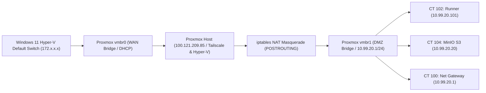

# 01. Architecture and System Design

## 1. Overview & Hardware Constraints

Booth Homelab is engineered to deliver high-density, reproducible CI/CD execution directly on personal workstation hardware (**Acer Swift Go 14**). It utilizes nested virtualization to isolate execution runners from host operating system state while maximizing hardware performance.

### Hardware Specifications
- **Host Device:** Acer Swift Go 14 (AMD Ryzen AI CPU / AMD-V virtualization)
- **Host Operating System:** Windows 11 Insider Preview (Canary / Dev channel)
- **Hypervisor:** Microsoft Hyper-V (Nested Virtualization enabled via `Set-VMProcessor -ExposeVirtualizationExtensions $true`)
- **Virtual Appliance:** Proxmox VE 8.4.0 (Linux Kernel `6.8.12-9-pve`)
- **Resource Allocation to Proxmox VM:**
  - **vCPU:** 4 Cores (Dynamic core pinning)
  - **RAM:** 10,240 MB (10 GB) with 1 GB ballooning headroom
  - **Storage:** 64 GB Virtual Disk (ZFS / ext4 root volume)

---

## 2. Network Topology & Dual-Bridge Architecture

To prevent network loops and allow isolated high-speed inter-container communication, Proxmox is configured with two distinct network bridges:



### Network Interfaces Specification (`/etc/network/interfaces`)
```ini
auto lo
iface lo inet loopback

# Hyper-V External Uplink (WAN)
auto vmbr0
iface vmbr0 inet dhcp
    bridge-ports eth0
    bridge-stp off
    bridge-fd 0

# Isolated DMZ Virtual Switch (LAN / Bus)
auto vmbr1
iface vmbr1 inet static
    address 10.99.20.1/24
    bridge-ports none
    bridge-stp off
    bridge-fd 0
    # Enable IPv4 Forwarding and NAT Masquerade
    post-up   iptables -t nat -A POSTROUTING -s 10.99.20.0/24 -o vmbr0 -j MASQUERADE
    post-down iptables -t nat -D POSTROUTING -s 10.99.20.0/24 -o vmbr0 -j MASQUERADE
```

---

## 3. LXC Container Matrix

| CT ID | Hostname | Template / OS | IP Address | vCPU | RAM | Storage | Role |
| :--- | :--- | :--- | :--- | :--- | :--- | :--- | :--- |
| **CT 100** | `net-gateway` | Alpine 3.23 Standard | `10.99.20.1` | 1 | 128 MB | 4 GB | Zero-Trust DMZ Gateway (nftables) |
| **CT 101** | `shared-cache` | Alpine 3.23 Standard | `10.99.20.10` | 2 | 512 MB | 8 GB | BaGet NuGet & Verdaccio npm Cache |
| **CT 102** | `gha-runner-01` | Debian 12 Standard | `10.99.20.101` | 2 | 2,048 MB | 12 GB | .NET 8 Unit & Integration Test Runner (`[dotnet]`) |
| **CT 103** | `gha-runner-angular` | Debian 12 Standard | `10.99.20.103` | 2 | 1,536 MB | 12 GB | Angular Jest Unit Test Runner (`[angular]`) |
| **CT 104** | `minio-s3` | Alpine 3.23 Standard | `10.99.20.20` | 2 | 512 MB | 16 GB | Distributed S3 Cache (Build & Artifacts) |

---

## 4. Architectural Invariants & Security
1. **Runner Isolation:** Runners operate inside unprivileged LXC containers with strictly scoped capabilities (`features: nesting=1,keyctl=1`).
2. **Branch-Scoped Cache Isolation:** MinIO storage uses branch prefixes (`branches/<branch-name>/`) to prevent cache poisoning across pull requests (addressing CREEP attack vectors / CVE-2025-36852).
3. **Zero Host Pollution:** Build artifacts and package dependencies never leak into the host Proxmox root filesystem.
