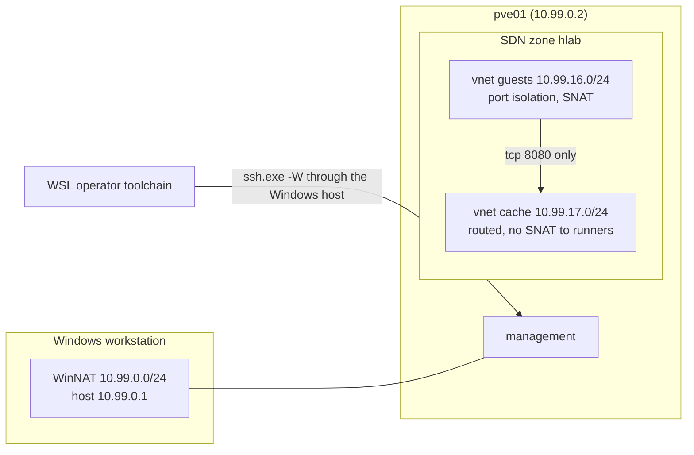

# 01. Architecture and Design

## Layers

| Layer | What | Decision |
|---|---|---|
| Workstation | Windows 11 Pro with Hyper-V enabled; WSL Debian holds the operator toolchain (OpenTofu, Ansible, SOPS) | ADR 0010 |
| Virtual appliance | Hyper-V Gen2 VM `pve01` running Proxmox VE 9, nested virtualization on | ADR 0003, 0004 |
| Guests | LXC containers and KVM VMs on `local-lvm`, cloned from golden templates | ADR 0038, 0039 |
| Services | The build cache container `cache01` | ADR 0045, 0048 |

The VM has 12 vCPU, 20 GiB static RAM and a dynamic VHDX capped at 128 GiB (decision D19; the budget was lowered after the workstation's free RAM and disk were measured, requirements rows 28 and 29). Nested KVM works with Memory Integrity on (row 36). The VM starts on demand, never with Windows (D21).

## Networks

| Network | Range | Notes |
|---|---|---|
| Management (Hyper-V internal switch + WinNAT) | `10.99.0.0/24`; host `.1`, `pve01` `.2` | ADR 0006. The VM has no port mapping and the host opens no new listener |
| `guests` vnet | `10.99.16.0/24`, gateway `.1` | Static addresses, no DHCP, `isolate_ports`, source-NATed out of `vmbr0` (ADR 0030, row 50) |
| `cache` vnet | `10.99.17.0/24`, gateway `.1`, cache at `.10` | Routed through `pve01`; runner-to-cache traffic keeps the runner's address (ADR 0045, row 61) |

Remote access: SSH from WSL reaches `pve01` only through a `ProxyCommand` on the Windows `ssh.exe` with the host key pinned from SOPS (ADR 0011, 0022). `pve01` is not on the tailnet; the web UI is reached through a single forwarded port on the Windows host (ADR 0008).

## Isolation (R15)

Code that runs in a runner must reach no private network that the workstation is attached to: the VPN-routed prefixes, tailnet peers, the home LAN, the Windows host and the PVE management ports.

| Layer | Mechanism | Decision |
|---|---|---|
| 1 | Hyper-V extended port ACLs on the VM adapter (deny private, CGNAT, link-local and every prefix routed over another interface; allow stateful TCP and UDP out) plus a Windows Firewall block rule on the internal vEthernet | ADR 0007 |
| 2 | Classic PVE firewall: `policy_out DROP` per guest, security group `guest-egress` (deny the host-routed set, then accept public IPv4), a `cache-ingress` group on the cache container, a guard timer that stops any guest whose firewall deviates | ADR 0027, 0037, 0047 |

Proof is red first with paired controls, run in four phases (baseline, container restart, PVE reboot, host reboot): requirements rows 38, 42, 51, 52, 59 and 66. Two rows stay `NOT MEASURED` in every phase because no positive control exists for them (row 52).

## Guests and identifiers

| Guest | VMID | Source |
|---|---|---|
| `cache01` (container) | 9050 | Debian 13 container template, on the `cache` vnet |
| Probe container and VM | 9101 and 9102 | Linked clones of the current templates, throwaway |
| `lxc-runner` templates | block 9200 to 9299 | Built by `homelab-template` |
| `vm-docker` templates | block 9300 to 9399 | Built by `homelab-template` |

Runner guests do not exist yet (Phase 5).

## Invariants

1. Docker workloads run in VMs, never in privileged containers (ADR 0015).
2. One owner per object: Ansible owns OS configuration, the OpenTofu API identity and the firewall files; OpenTofu owns SDN, guests and guest firewall options (ADR 0025).
3. The API token cannot create users, change the host or delete a template; it can clone templates only from pool `templates` (ADR 0026, 0036).
4. Host-specific code (Hyper-V, Windows firewall) stays apart from the portable core (Proxmox roles, stacks, templates, workflows), so an adopter can drop the host layer (R18).
