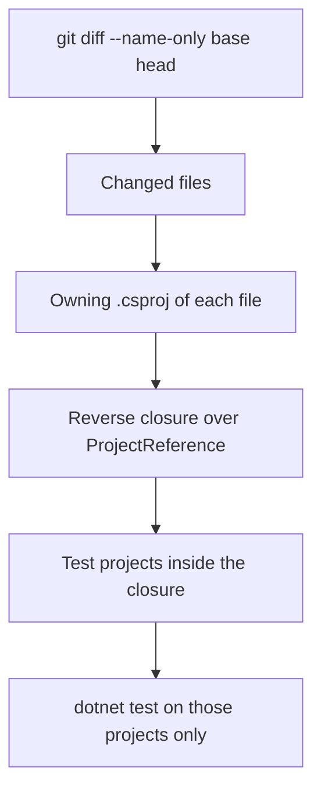
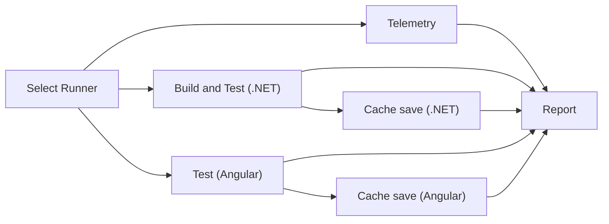

# 04. Transitive Affected Testing and Pipeline Layout

## Affected-test selector

`scripts/apps/dotnet-affected-test.sh` runs only the .NET test projects that a change can affect. It is the only implementation ([ADR 0056](https://github.com/ugritchaichana/booth-homelab/blob/master/docs/adr/0056-keep-one-implementation-of-the-affected-test-selector.md)).

Test projects are matched by file name (`*test*.csproj`), never by path, so a checkout directory with "test" in its name cannot widen the selection.

Fail-closed rules:

- A change to shared build configuration (`Directory.Build.props`, `Directory.Packages.props`, `nuget.config`, `global.json`, a `.sln`) selects every test project.
- A non-documentation change that maps to no project selects the full suite.
- A documentation-only change, or no change at all, exits 0 and runs nothing. With no committed change the script falls back to the working tree.

Example on the sample solution: a change under `src/Billing.Api/` selects `Billing.Api.UnitTests` and `Order.Api.IntegrationTests` (it references `Billing.Api`) and skips `Order.Api.UnitTests`; a change under `src/Core.Domain/` reaches `Order.Api` through `Core.Application` and selects the two Order test projects.

## Selector tests

`tests/verify-affected-graph.sh` checks the exact set of selected projects in disposable clones. `affected-selector-ci.yml` then runs it against three mutants of the selector; each must fail the named scenario, so the harness is not vacuous.

| Mutant | What it removes from the selector | Scenario that must fail |
|---|---|---|
| `drop-unmappable-block` | the whole branch for a change that maps to no project, including the documentation-only exit | docs only |
| `drop-unmappable-fallback` | the line that selects the full suite for an unmappable non-documentation change | unmappable change fails closed |
| `drop-shared-config-widening` | the line that selects every test project on a shared-config change | shared config plus mapped project |

Per-test detail: [docs/knowledge/test-catalogue.md](https://github.com/ugritchaichana/booth-homelab/blob/master/docs/knowledge/test-catalogue.md).

## Pipeline layout

`sdet-ci.yml` handles `push`, `pull_request` and `workflow_dispatch` and calls the reusable workflow `reusable-sdet-pipeline.yml`. Cache numbers and the stale-binary rule: page 03.

The `select-runner` job picks the runner labels once; every other job needs it. `Report` runs on `ubuntu-latest` on both paths: it only prints, and a job on the self-hosted runner costs about 10 s more than on a hosted one ([ADR 0060](https://github.com/ugritchaichana/booth-homelab/blob/master/docs/adr/0060-run-own-ci-on-one-persistent-runner-container-behind-a-job-start-guard.md)).

| Job | Restores | Saves |
|---|---|---|
| Build and Test (.NET) | `nuget`, then `dotnet restore --locked-mode`, then `dotnet-outputs` | none; on a self-hosted default-branch push it packs the payloads as an artifact after the compile and before the tests |
| Cache save (.NET) | none | `nuget`, `dotnet-outputs`; default-branch push on self-hosted runners only, when the compile succeeded (job output `compiled`, even if a test failed), environment `cache-writer` |
| Test (Angular) | `node_modules`, `npm ci` on a miss | none; on a self-hosted default-branch push it packs `node_modules` as an artifact |
| Cache save (Angular) | none | `node_modules`; same conditions as the .NET save |

Composite actions: `.github/actions/build-cache` (restore and save), `run-affected-tests` (the selector), `run-angular-jest`.

## Runner selection

The `select-runner` job chooses the labels `self-hosted`, `linux`, `proxmox` and `dotnet` or `angular`, or `ubuntu-latest`, and writes the reason to its summary ([ADR 0062](https://github.com/ugritchaichana/booth-homelab/blob/master/docs/adr/0062-route-ci-by-runner-health-and-retry-once-on-hosted-after-an-infra-failure.md)):

1. **Forced hosted.** `force_ubuntu_runner` is true (set by `sdet-ci.yml` unless the repository variable `CI_RUNNER` is `proxmox`, and for every fork pull request), or the repository is not this one.
2. **Rerun after a runner failure.** The previous attempt failed on Proxmox with an infra fingerprint: hosted.
3. **Health check.** The runners API, read with the secret `RUNNER_STATUS_TOKEN`:
   - at least one online runner labelled `proxmox` keeps the run on Proxmox, even when every runner is busy;
   - none online sends it to hosted;
   - without the token, or on an API error, the variable decides.

`CACHE_URL` follows the route: a run on hosted runners executes with the cache disabled.

An infra fingerprint is a Proxmox job that failed although no step of its own failed, with a step cancelled under it (measured by restarting a runner mid-job), or one of the runner-loss messages GitHub documents. A failed test, compile or guard step is never one. The callback reruns such a run once, and the rerun's `select-runner` sends it to hosted. On the self-hosted runner a job-start hook refuses every event except `push`, `workflow_dispatch`, `schedule` and a pull request from a branch of this repository, before the job's first step ([ADR 0060](https://github.com/ugritchaichana/booth-homelab/blob/master/docs/adr/0060-run-own-ci-on-one-persistent-runner-container-behind-a-job-start-guard.md); runbook 3.7). Back to hosted for every run: `gh variable set CI_RUNNER --body hosted`.

## Other workflows

| Workflow | Runs on |
|---|---|
| `iac-ci.yml` | `iac/`, `tests/isolation/`: OpenTofu lint, validate and test; Ansible lint, syntax, isolation tests, Molecule |
| `cache-ci.yml` | `scripts/ci/build_cache/`, `tests/cache/`, `apps/`, the reusable pipeline: client tests, locked restores, stale-binary test |
| `evidence-ci.yml` | `docs/evidence/`, `docs/knowledge/`, `scripts/evidence/`, `tests/evidence/`: publisher tests and the published-text check |
| `affected-selector-ci.yml` | `scripts/apps/dotnet-affected-test.*`, `tests/`: selector harness and mutants |
| `hyperv-ci.yml` | `scripts/hyperv/`, `tests/hyperv/`: Pester tests of the Windows host layer |
| `secret-scan.yml` | every pull request and push to the default branch: gitleaks |
| `standard-scorecard.yml` | pull requests and pushes to the default branch, weekly: the scorecard and the documentation-claims check ([standard/README.md](https://github.com/ugritchaichana/booth-homelab/blob/master/standard/README.md)) |
| `sdet-fallback-drill.yml` | monthly: the full pipeline on hosted runners |
| `sdet-callback.yml` | every finished SDET run: one comment on its pull request with the pass rate per suite, every failed test with its message and stack, and the log tail of a job that failed outside the tests ([ADR 0061](https://github.com/ugritchaichana/booth-homelab/blob/master/docs/adr/0061-report-each-sdet-run-on-its-pull-request-from-a-workflow-run-callback.md)); after an infra failure on Proxmox it reruns the run once on hosted ([ADR 0062](https://github.com/ugritchaichana/booth-homelab/blob/master/docs/adr/0062-route-ci-by-runner-health-and-retry-once-on-hosted-after-an-infra-failure.md)) |
| `report-ci.yml` | `scripts/ci/run_report.py`, `scripts/ci/runner_route.py` and the route scripts: parser and router tests held at full line, branch and condition coverage ([numbers](https://github.com/ugritchaichana/booth-homelab/blob/master/docs/knowledge/coverage.md)), shellcheck |
| `wiki-sync.yml` | `wiki/` on the default branch: mirrors the pages to the GitHub wiki |
| `pr-labeler.yml`, `pr-reviewer-guard.yml` | pull request events: area labels; removes an automatic reviewer request |
