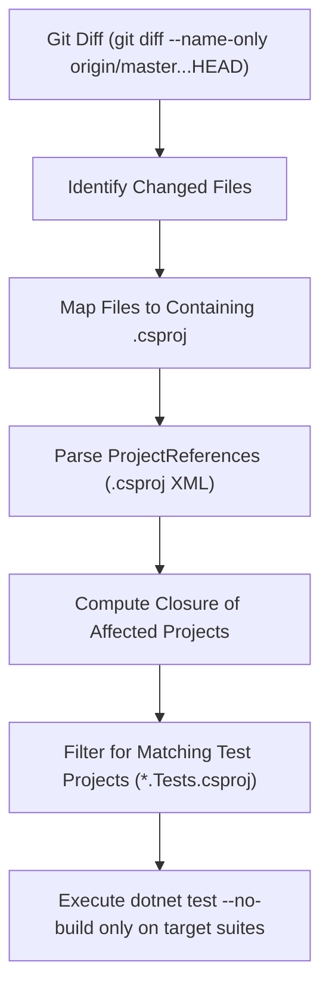

# 04. SDET Transitive Affected Testing & Cache Optimization

## 1. Problem Statement & First-Principles Solution

In a growing enterprise microservice repository or monorepo, running every test suite and recompiling untouched code on every pull request leads to linear CI degradation:

$$\text{Pipeline Latency} \propto \sum (\text{Build Time}_i + \text{Test Time}_i)$$

To achieve sub-30-second pipeline execution, Booth Homelab implements two complementary techniques:
1. **Transitive Affected Test Graph Resolution** (`scripts/ci/run_affected_tests.py`)
2. **MSBuild Timestamp Synchronization** (Selective `mtime` synchronization)

---

## 2. Transitive Affected Graph Engine

The Python script `scripts/ci/run_affected_tests.py` analyzes the git diff against the target base branch (`origin/master`):



### Example Graph Behavior:
- **Change in `src/Billing.Api/`**:
  - Direct affected: `Billing.Api`
  - Transitive affected tests: `Billing.Api.UnitTests`
  - Skipped: `Order.Api`, `Order.Api.UnitTests` (**0 seconds wasted**)
- **Change in `src/Order.Api/`**:
  - Direct affected: `Order.Api`
  - Transitive affected tests: `Order.Api.UnitTests`
  - Skipped: `Billing.Api`, `Billing.Api.UnitTests` (**0 seconds wasted**)

---

## 3. MSBuild Timestamp Synchronization

Normally, extracting a tarball restores files with identical or reset modification timestamps (`mtime`). If source files have timestamps newer than compilation outputs (`bin/` and `obj/`), MSBuild will rebuild everything. Conversely, if source timestamps are older, MSBuild might skip compiling modified files.

To guarantee correctness and maximal caching:
1. **Preserve Exact Timestamps on Restore:**
   ```bash
   tar -I "zstd -T0 -3" -xf build-cache.tar.zst
   ```
2. **Bump Modification Timestamps on Git-Modified Files:**
   ```bash
   for file in $(git diff --name-only origin/master...HEAD); do
     [ -f "$file" ] && touch "$file"
   done
   ```
3. **Run Incremental Build:**
   ```bash
   dotnet build --no-restore
   ```
   - **Untouched projects:** MSBuild prints `Skipping target "CoreCompile" because all output files are up-to-date with respect to the input files.`
   - **Modified projects:** Only touched C# sources are recompiled into their respective assemblies.
