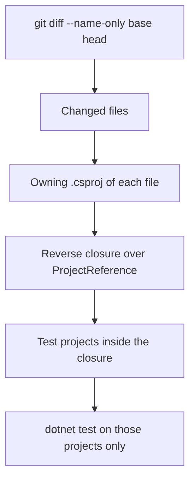
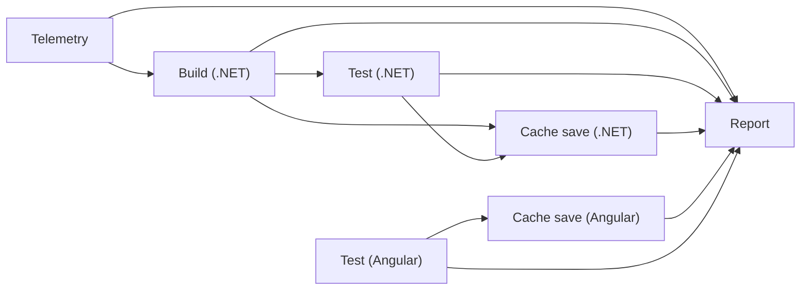

# 04. Transitive Affected Testing and Pipeline Layout

## Affected-test selector

`scripts/apps/dotnet-affected-test.sh` (Linux) and `dotnet-affected-test.ps1` (Windows) run only the .NET test projects that a change can affect:

Fail-closed rules:

- A change to shared build configuration (`Directory.Build.props`, `Directory.Packages.props`, `nuget.config`, `global.json`, a `.sln`) selects every test project.
- A non-documentation change that maps to no project selects the full suite.
- A documentation-only change, or no change at all, exits 0 and runs nothing. With no committed change the script falls back to the working tree.

Example on the sample solution: a change under `src/Billing.Api/` selects `Billing.Api.UnitTests` and `Order.Api.IntegrationTests` (it references `Billing.Api`) and skips `Order.Api.UnitTests`; a change under `src/Core.Domain/` reaches `Order.Api` through `Core.Application` and selects the two Order test projects.

The harness `tests/verify-affected-graph.sh` (and the `.ps1` twin) checks the exact set of selected projects in disposable clones. The workflow `affected-selector-ci.yml` adds three mutants of the selector that each must fail a named scenario, so the harness is not vacuous (`docs/knowledge/test-catalogue.md`).

## Build outputs and correctness

The selector decides what to test. What to rebuild is decided by the build cache: outputs are restored only on an exact match of the input tree ids, so a changed source never meets a stale binary (page 03, ADR 0049). The earlier approach of bumping timestamps on changed files was replaced; requirements row 18 records why and row 64 the test.

## Pipeline layout

`sdet-ci.yml` handles `push`, `pull_request` and `workflow_dispatch` and calls the reusable workflow `reusable-sdet-pipeline.yml`.

| Job | Restores | Saves |
|---|---|---|
| Build (.NET) | `nuget`, then `dotnet restore --locked-mode`, then `dotnet-outputs` | none |
| Cache save (.NET) | none | `nuget`, `dotnet-outputs`; default-branch push only, environment `cache-writer` |
| Test (Angular) | `node_modules`, `npm ci` on a miss | none |
| Cache save (Angular) | `node_modules` | `node_modules`; default-branch push only, environment `cache-writer` |

Composite actions: `.github/actions/build-cache` (restore and save), `run-affected-tests` (the selector), `run-angular-jest`.

## Runner selection

The reusable pipeline asks for the labels `self-hosted`, `linux`, `proxmox` and `dotnet` or `angular` for this repository, and for `ubuntu-latest` when `force_ubuntu_runner` is true or in any other repository. No self-hosted runner is online until the Phase 5 pool exists, so `sdet-ci.yml` sets `force_ubuntu_runner` on push and pull request and defaults it to true on dispatch: CI runs on hosted runners today (ADR 0054, `docs/adr/0054-run-ci-on-hosted-runners-until-the-runner-pool-exists.md`). A hosted run executes with the cache disabled (row 68). The override is removed at the Phase 6 cutover. Before then, fork pull requests must be routed to hosted runners on their own, because the reusable pipeline's expression alone would send them to the self-hosted labels (row 27, decision D17).

## Other workflows

| Workflow | Runs on changes to |
|---|---|
| `iac-ci.yml` | `iac/`, `tests/isolation/`: OpenTofu lint, validate and test; Ansible lint, syntax, isolation tests, Molecule |
| `cache-ci.yml` | `scripts/ci/build_cache/`, `tests/cache/`, `apps/`: client tests, locked restores, stale-binary test |
| `evidence-ci.yml` | `docs/evidence/`, `docs/knowledge/`, `scripts/evidence/`, `tests/evidence/`: publisher tests and the published-text check |
| `affected-selector-ci.yml` | the selector scripts and `tests/` |
| `secret-scan.yml` | every pull request and push: gitleaks |
| `wiki-sync.yml` | `wiki/` on the default branch: mirrors the pages to the GitHub wiki |
