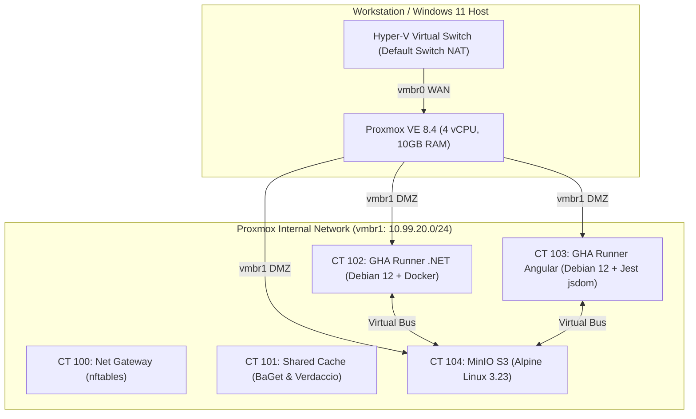

# Booth Homelab & SDET Infrastructure Knowledge Base

Welcome to the central knowledge repository for **Booth Homelab** — a CI/CD and SDET testing rig running on Proxmox VE 8.4 (nested inside Hyper-V on Windows 11 host).

---

## 🧭 Navigation & Table of Contents

| Section | Description | Direct Link |
| :--- | :--- | :--- |
| **01. Architecture & Design** | Hypervisor topology, DMZ network bridges, LXC container specifications | [📖 01-Architecture-and-Design](https://github.com/ugritchaichana/booth-homelab/wiki/01-Architecture-and-Design) |
| **02. GitHub Actions Runners** | CT 102 (.NET 8) & CT 103 (Angular Jest) runner provisioning & Docker-in-LXC | [📖 02-GitHub-Actions-Runner-LXC](https://github.com/ugritchaichana/booth-homelab/wiki/02-GitHub-Actions-Runner-LXC) |
| **03. MinIO S3 Remote Cache** | CT 104 Alpine MinIO cache, Zstandard compression, virtual bus transfer | [📖 03-MinIO-S3-Remote-Cache](https://github.com/ugritchaichana/booth-homelab/wiki/03-MinIO-S3-Remote-Cache) |
| **04. Transitive Affected Testing** | Monorepo dependency graph, git diff detection, MSBuild timestamp sync | [📖 04-SDET-Transitive-Affected-Testing](https://github.com/ugritchaichana/booth-homelab/wiki/04-SDET-Transitive-Affected-Testing) |
| **05. Benchmark Results** | Live telemetry data: Cold run vs. Warm cache hit (PR #1, PR #2) | [📖 05-Performance-Benchmark-Results](https://github.com/ugritchaichana/booth-homelab/wiki/05-Performance-Benchmark-Results) |
| **06. Operational Runbooks** | Disaster recovery, networking rescue, host bootstrap, and troubleshooting | [📖 06-Operational-Runbooks-and-Troubleshooting](https://github.com/ugritchaichana/booth-homelab/wiki/06-Operational-Runbooks-and-Troubleshooting) |

---

## ⚡ System Highlights & Measured Performance

### Key Performance Metrics
- **Virtual Bus Cache Throughput:** 824.29 MiB/s for a `node_modules` restore across the `vmbr1` internal bridge ([run 37235401356](https://github.com/ugritchaichana/booth-homelab/actions/runs/37235401356/job/111533373752)).
- **Remote Cache Download Time:** `Downloaded in 101 ms` for the .NET payload ([run 37235401356](https://github.com/ugritchaichana/booth-homelab/actions/runs/37235401356/job/111533415551)).
- **Angular Jest Execution:** `Completed in: 3856 ms` (19 tests across 4 suites) ([run 37235401356](https://github.com/ugritchaichana/booth-homelab/actions/runs/37235401356/job/111533373752)).
- **Affected Test Resolution:** unaffected suites do not run; see the per-run logs in page 05.
- **Dual-Runner Parallel Execution:** Both .NET and Angular suites execute concurrently.

---

## 🔗 External Traceability Links
- **GitHub Repository:** [ugritchaichana/booth-homelab](https://github.com/ugritchaichana/booth-homelab)
- **Universal AI Agent Guide:** [AGENTS.md](https://github.com/ugritchaichana/booth-homelab/blob/master/AGENTS.md)
- **AI Handover Prompt:** [HANDOFF.md](https://github.com/ugritchaichana/booth-homelab/blob/master/HANDOFF.md)
- **GitHub Project Board:** [Booth Homelab SDET Delivery (#4)](https://github.com/users/ugritchaichana/projects/4)
- **Releases:** [Releases](https://github.com/ugritchaichana/booth-homelab/releases)
- **MinIO Web Console:** `http://100.121.209.85:9001` (Object Browser)
- **Proxmox Web GUI:** `https://100.121.209.85:8006` (Linux PAM authentication)
